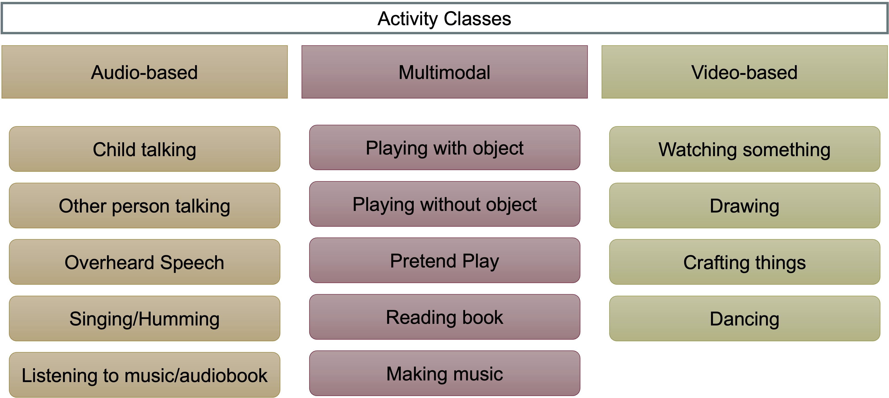
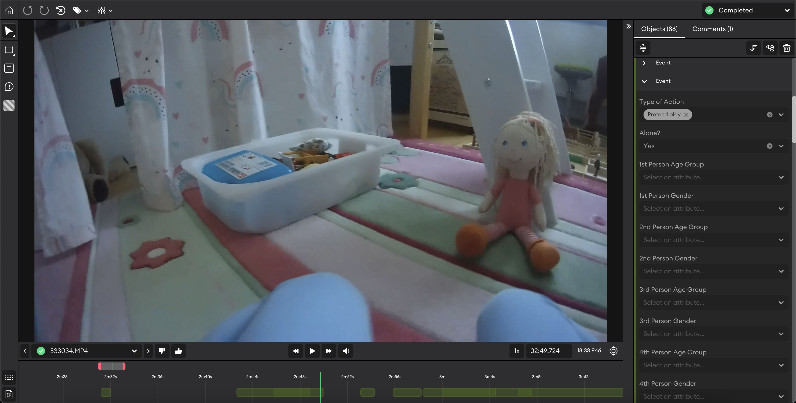
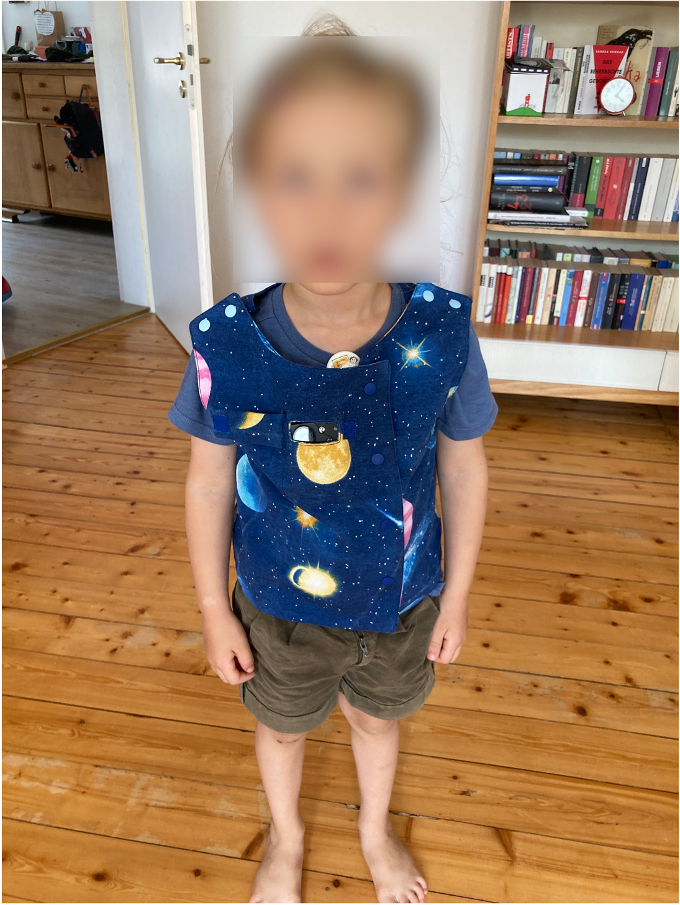

```{r setup, include = FALSE}
library(papaja)
library(tidyverse)
library(ggplot2)
library(brms)
library(ggthemes)
library(ggpubr)
library(BayesFactor)
library(broom)
library(coda)
library(reshape2)
library(ggridges)

estimate_mode <- function(s) {
  d <- density(s)
  return(d$x[which.max(d$y)])
}

hdi_upper<- function(s){
  m <- HPDinterval(mcmc(s))
  return(m["var1","upper"])
}

hdi_lower<- function(s){
  m <- HPDinterval(mcmc(s))
  return(m["var1","lower"])
}
```

```{r analysis-preferences}
# Seed for random number generation
set.seed(42)
knitr::opts_chunk$set(cache.extra = knitr::rand_seed)
knitr::opts_chunk$set(echo = F, warning = F, message = F)
```

# Introduction

Lorem ipsum dolor sit amet, consectetur adipiscing elit. Sed ac purus sit amet nisl tincidunt tincidunt. Nullam nec turpis at libero tincidunt tincidunt. Sed nec mi nec nunc tincidunt tincidunt. Nullam nec turpis at libero tincidunt tincidunt. Sed nec mi nec nunc

# Dataset Overview

#### Activity Classes
The ChildLens dataset contains a total of 14 activity and 5 location classes. The activities are based on the actions of the child in the video and can be divided into _person-only_ activities, such as "child talking" or "other person talking, and _person-object interaction_ activities, such as "drawing" or "playing with object". You can find the complete list of activity classes in the appendix.. The activities can be further divided into _audio-based_, _visual-based_, and _multimodal_ activities, as presented in /@ref(fig:activity-classes). The following list provides an overview of the different activity types:

- **Audio-based activities**: _child talking_, _other person talking_, _overheard speech_, _singing / humming_, _listening to music / audiobook_
- **Visual-based activities**: _watching something_, _drawing_, _crafting things_, _dancing_
- **Multimodal activities**: _playing with object_, _playing without object_, _pretend play_, _reading book_, _making music_

The location classes describe the current location of the child in the video and include _livingroom_, _playroom_, _bathroom_, _hallway_, and _other_.

```{r activity-classes, dpi=700, fig.align='center', fig.cap="Vest with the embedded camera worn by the children"}

```

#### Statistics
We have varying numbers of clips for each of the 14 activity classes, ranging from *x* to *x* clips per class. The duration of the clips differs depending on the activity; for example, audio-related actions like "child talking" may only last a few seconds, while activities like "reading a book" may last several minutes. The xxx video clips are divided into *xx-xx * training clips, *xx** validation clips, and *xx* testing clips for each class. Table \@ref(tab:train-val-test) provides an overview of the numbers.

```{r train-val-test, echo=FALSE, message=FALSE, warnings=FALSE, results='asis'}
my.data <- "training | validation | testing
            10        | 10           | 10"
df <- read.delim(textConnection(my.data), header=FALSE, sep="|", strip.white=TRUE, stringsAsFactors=FALSE)
# Set the first row as column names
names(df) <- unname(as.list(df[1,]))
# Remove the first row (which is now used as column names)
df <- df[-1,] 
row.names(df) <- NULL
# Create the table using apa_table function
apa_table(
  df,
  caption = "Number of clips per class",
  escape = TRUE,
)
```

#### Exhaustive multi-label annotations
The dataset provides detailed annotations for each video file. These annotations specify the child’s current location within the video, the start and end times of each activity, the activity class, and whether the child is engaged alone or with somebody else. For every person involved in the activity, we capture age and gender. If multiple activities occur simultaneously in a video, each activity is individually labeled and extracted as a separate clip. For example, if a segment shows a child “reading a book” while also “talking,” two separate clips are created: one for “reading a book” and another for “child talking.” This exhaustive labeling strategy ensures that each activity is accurately represented in the dataset. 


```{r superannotate, dpi=600, fig.align='center', fig.cap="SuperAnnotate platform utilized for video annotation"}

```

# Dataset Generation
This section outlines the steps taken to create the ChildLens dataset. We provide detailed information on the video collection process, the labeling strategy employed, and the generation of activity labels.

## Step 1: Collection of Egocentric Videos
The ChildLens dataset consists of egocentric videos recorded by children aged 3 to 5 years. A total of xx children from families living in a mid-sized city in Germany, participated in the study. The videos were captured at home using a camera embedded in a vest worn by the children, which can be seen in figure \@ref(fig:camera-worn). This setup allowed the children to move freely throughout their homes while recording their activities. The camera captured within the child's field of view, while an integrated camera recorded the audio. Additionally, the parents were handed a small checklist of activities to record, ensuring that a variety of activities were captured in the videos. The focus was on everyday activities that children typically engage in, such as playing with toys, reading books, or drawing. The videos were recorded over a period of xx months, resulting in a total of xx hours of video footage.


```{r camera-worn, dpi=500, fig.align='center', fig.cap="Vest with the embedded camera worn by the children"}

```

## Step 2: Creation of Labeling Strategy
The labeling strategy for the ChildLens dataset was designed to capture the child's daily activities accurately and is based on the instructions given to the parents. The parents were provided with a list of activities to record, including the following activities:
- Child is invited to read a book together with an adult
- Child is invited to play with toys alone
- Child is invited to play with toys with someone else (adult or child)
- Child is invited to draw/craft something

After an initial review of the videos, we identified the most common activities that children engage in throughout the day. The activity classes in the dataset are derived from these activities. We chose to differentiate, for example, between "drawing" and "crafting things" or "making music" and "singing/humming" in order to make the activities more granular. We also added the concepts of "overheard speech", which describes situations in which the child is not directly involved in a conversation but can hear it, and "pretend play", which refers to when the child is engaged in imaginative play. This approach allowed us to capture the diversity of activities that children engage in and create a comprehensive dataset for activity analysis.

## Step 3: Manual Labeling Process
The videos were manually annotated by native German speakers who watched each video and labeled the activities present in the footage. The annotators marked the start and end points of each activity, ensuring that the annotations were accurate and detailed. The labeling process was conducted using the SuperAnnotate platform, which allowed for efficient annotation and review of the videos. 

- labeling process means looking at the whole video and mark start and end point of each activity present in the list of activities
- we annotate the videos using humans
- native germans for labeling task
- use SuperAnnotate platform for labeling
- review system: always two annotators label the same video, 
*-TODO: ask how exactly the review process works

- in setup meeting we discussed the labeling strategy and the classes and handed over the annotation strategy to the annotators
- before starting annotation process, we made sure that all questions were answered and that the annotators understood the task
- before the actual annotation process started, the annotators labeled  25 videos to get a feeling for the task
- the annotations then were reviewed by us and feedback was shared
- in total three feedback loops were conducted to ensure that the annotators followed the labeling strategy


# Benchmark Performance
## Implementation details

## Boundary-Matching Network 
We utilize the BMN model [@linBMNBoundaryMatchingNetwork2019] for temporal activity localization.


## VTC
For the visual-based activities, we use the Voice Type Classifier [@lavechinOpensourceVoiceType2020].


# Conclusion


# Discussion
## Dataset bias

## General Discussion


\newpage
# References
We used `r cite_r("r-references.bib")` for all our analyses.
```{r create_r-references}
r_refs(file = "bibliography.bib")
```

\begingroup
\setlength{\parindent}{-0.5in}
\setlength{\leftskip}{0.5in}

<div id = "refs"></div>
\endgroup

\newpage
# Appendix

## List of ChildLens Activity Classes

The dataset contains the following list of activities. The number of clips for each activity class is indicated by the number in brackets behind each class.

1. playing with object \textcolor{red}{TBD}
2. playing without object \textcolor{red}{TBD}
3. pretend play \textcolor{red}{TBD}
4. watching something \textcolor{red}{TBD}
5. reading book \textcolor{red}{TBD}
6. child talking \textcolor{red}{TBD}
7. other person talking \textcolor{red}{TBD}
8. overheard speech \textcolor{red}{TBD}
9. drawing \textcolor{red}{TBD}
10. crafting things \textcolor{red}{TBD}
11. singing / humming \textcolor{red}{TBD}
12. making music \textcolor{red}{TBD}
13. dancing \textcolor{red}{TBD}
14. listening to music / audiobook \textcolor{red}{TBD}

## List of ChildLens Location Classes

1. livingroom
2. playroom
3. bathroom
4. hallawy
5. other

