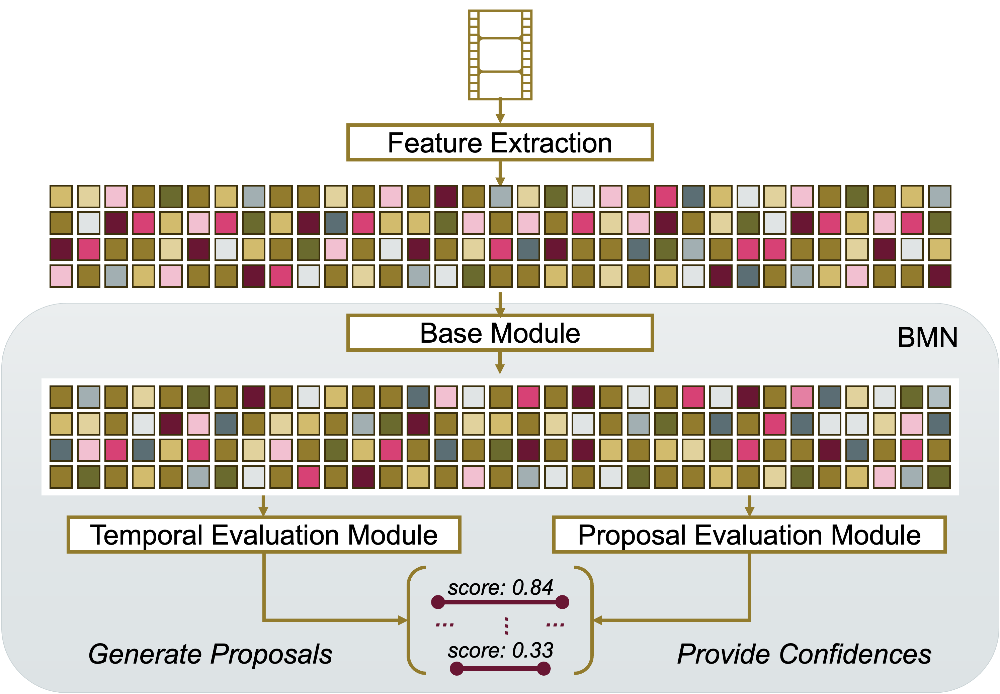
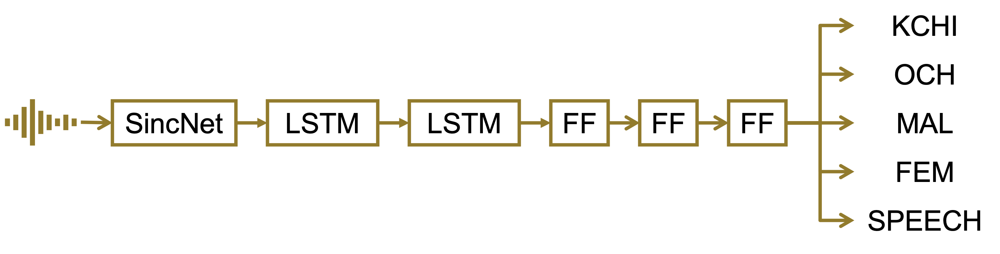

```{r setup, include = FALSE}
library(papaja)
library(tidyverse)
library(ggplot2)
library(brms)
library(ggthemes)
library(ggpubr)
library(BayesFactor)
library(broom)
library(coda)
library(reshape2)
library(ggridges)
library(readxl)
library(dplyr)
library(lubridate)
library(zoo)
library(gridExtra)
library(grid)


estimate_mode <- function(s) {
  d <- density(s)
  return(d$x[which.max(d$y)])
}

hdi_upper<- function(s){
  m <- HPDinterval(mcmc(s))
  return(m["var1","upper"])
}

hdi_lower<- function(s){
  m <- HPDinterval(mcmc(s))
  return(m["var1","lower"])
}
```

```{r analysis-preferences}
# Seed for random number generation
set.seed(42)
knitr::opts_chunk$set(cache.extra = knitr::rand_seed)
knitr::opts_chunk$set(echo = F, warning = F, message = F)
```

# Introduction

Lorem ipsum dolor sit amet, consectetur adipiscing elit. Sed ac purus sit amet nisl tincidunt tincidunt. Nullam nec turpis at libero tincidunt tincidunt. Sed nec mi nec nunc tincidunt tincidunt. Nullam nec turpis at libero tincidunt tincidunt. Sed nec mi nec nunc

- TODO: research about egocentric video datasets

# Dataset Overview

#### Activity Classes
The ChildLens dataset contains a total of 14 activity and 5 location classes. The activities are based on the actions of the child in the video and can be divided into _person-only_ activities, such as "child talking" or "other person talking, and _person-object_ activities, such as "drawing" or "playing with object". You can find the complete list of activity classes with a brief description in the appendix. The activities can be further divided into _audio-based_, _visual-based_, and _multimodal_ activities, as presented in figure \@ref(fig:activity-classes). The following list provides an overview of the different activity types:

- **Audio-based activities**: _child talking_, _other person talking_, _overheard speech_, _singing / humming_, _listening to music / audiobook_
- **Visual-based activities**: _watching something_, _drawing_, _crafting things_, _dancing_
- **Multimodal activities**: _playing with object_, _playing without object_, _pretend play_, _reading book_, _making music_

The location classes describe the current location of the child in the video and include _livingroom_, _playroom_, _bathroom_, _hallway_, and _other_.

```{r activity-classes, dpi=600, fig.align='center', fig.cap="ChildLens Activity Class Categories"}
knitr::include_graphics("activity_classes.png")
```

#### Statistics

```{r video-statistics, echo=FALSE, message=FALSE, warning=FALSE, fig.cap="Video recording duration (in minutes) per child ID."}
data <- read_csv2("quantex_share_data_sheet.csv")
subject_infos <- read_csv("subjects_quantex_at_home.csv")

subject_infos <- subject_infos %>%
  rename(ID = `ID No.`)

unique_data <- data %>%
  filter(!is.na(Minutes_per_ID), Minutes_per_ID != 0, 
         !is.na(ID), Labeled == "yes") %>%
  distinct(ID, Minutes_per_ID, .keep_all = TRUE)

unique_data <- unique_data %>%
  mutate(ID = as.double(ID))

subject_infos <- subject_infos %>%
  mutate(ID = as.double(ID))

# Merge unique_data with subject_infos based on ID
merged_data <- unique_data %>%
  inner_join(subject_infos, by = "ID")
print(unique_data$ID)
print(subject_infos$ID)
print(merged_data)

gender_counts <- merged_data %>%
  group_by(Gender) %>%
  summarise(count = n(), .groups = "drop")

# Print the result
print(gender_counts)
filtered_data <- data %>%
  filter(!is.na(Date), Labeled == "yes") %>%
  mutate(Date = as.Date(Date, format = "%d.%m.%Y")) 

min_minutes <- min(unique_data$Minutes_per_ID[unique_data$Minutes_per_ID > 0], na.rm = TRUE)
max_minutes <- max(unique_data$Minutes_per_ID, na.rm = TRUE)
sum_minutes <- sum(unique_data$Minutes_per_ID, na.rm = TRUE)
sum_hours <- sum_minutes/60
nr_children <- nrow(unique_data)

oldest_date <- min(filtered_data$Date)
youngest_date <- max(filtered_data$Date)

oldest_year <- as.numeric(format(oldest_date, "%Y"))
oldest_month <- as.numeric(format(oldest_date, "%m"))
youngest_year <- as.numeric(format(youngest_date, "%Y"))
youngest_month <- as.numeric(format(youngest_date, "%m"))

# Calculate the interval between the two dates
time_span_months <- (youngest_year - oldest_year) * 12 + (youngest_month - oldest_month)+1
```

The ChildLens dataset comprises `r sum_hours` hours of video material recorded by `r nr_children` children aged 3 to 5 years. For each child, the duration of recorded video material varies between `r min_minutes` and `r max_minutes` minutes. A detailed distribution of the video duration per child can be found in figure \@ref(fig:minutes-per-child). This diverse dataset also includes a varying number of clips for each of the 14 activity classes, ranging from **x** to **x** clips per class. The clip duration depends on the activity; for example, audio-related actions like "child talking" may only last a few seconds, while activities like "reading a book" may last several minutes. As shown in table \@ref(tab:train-val-test), the total number of **xx** clips is divided into **xx** training clips, **xx** validation clips, and **xx** testing clips for each class.


```{r minutes-per-child-density, echo=FALSE, message=FALSE, warning=FALSE, eval=FALSE, fig.cap="Video recording duration (in minutes) per child ID."}
unique_data$ID <- as.factor(unique_data$ID)

ggplot(unique_data, aes(x = Minutes_per_ID)) +
  geom_histogram(binwidth = 10) +
  scale_y_continuous(breaks = scales::pretty_breaks(n = 10), labels = scales::label_number(accuracy = 1)) +
  labs(x = "Minutes per ID", y = "Count") +
  theme_minimal()
```

```{r minutes-per-child, echo=FALSE, message=FALSE, warning=FALSE, fig.cap="Video recording duration (in minutes) per child ID."}
unique_data$ID <- as.factor(unique_data$ID)

ggplot(unique_data, aes(x = Minutes_per_ID)) +
  geom_point(aes(y = 0), shape = "I", size = 5) + 
  geom_density(fill = "gray", alpha = 0.5, color = "black") + 
  theme_minimal() +
  theme(legend.position = "none") +
  labs(
    x = "Minutes per ID",
    y = "Density"
  )
```

```{r train-val-test, echo=FALSE, message=FALSE, warnings=FALSE, results='asis', eval=FALSE}
my.data <- "training | validation | testing
            10        | 10           | 10"
df <- read.delim(textConnection(my.data), header=FALSE, sep="|", strip.white=TRUE, stringsAsFactors=FALSE)
# Set the first row as column names
names(df) <- unname(as.list(df[1,]))
# Remove the first row (which is now used as column names)
df <- df[-1,] 
row.names(df) <- NULL
# Create the table using apa_table function
apa_table(
  df,
  caption = "Number of clips per class",
  escape = TRUE,
)
```

#### Exhaustive multi-label annotations
The dataset provides detailed annotations for each video file. These annotations specify the child’s current location within the video, the start and end times of each activity, the activity class, and whether the child is engaged alone or with somebody else. For every person involved in the activity, we capture age and gender. If multiple activities occur simultaneously in a video, each activity is individually labeled and extracted as a separate clip. For example, if a segment shows a child “reading a book” while also “talking,” two separate clips are created: one for “reading a book” and another for “child talking.” This exhaustive labeling strategy ensures that each activity is accurately represented in the dataset. 

# Dataset Generation
This section outlines the steps taken to create the ChildLens dataset. We provide detailed information on the video collection process, the labeling strategy employed, and the generation of activity labels.

## Step 1: Collection of Egocentric Videos
The ChildLens dataset consists of egocentric videos recorded by children aged 3 to 5 years. A total of `r nr_children` children from families living in a mid-sized city in Germany, participated in the study. The videos were captured at home using a camera embedded in a vest worn by the children, which can be seen in figure \@ref(fig:camera-worn). This setup allowed the children to move freely throughout their homes while recording their activities. The camera, a _PatrolEyes WiFi HD Infrared Police Body Camera_, was equipped with a 140-degree wide-angle lens and captured everything within the child's field of view with a resolution of 1920x1080p at 30 fps. The camera also recorded audio, allowing us to capture the child's speech and other sounds in the environment. Additionally, the parents were handed a small checklist of activities to record, ensuring that a variety of activities were captured in the videos. The focus was on capturing everyday activities that children typically engage in. Parents were therefore asked to include the following activities in the recordings:

- Child is invited to read a book together with an adult
- Child is invited to play with toys alone
- Child is invited to play with toys with someone else (adult or child)
- Child is invited to draw/craft something

The videos were recorded over a period of `r time_span_months` months, resulting in a total of `r sum_hours` hours of video footage.

```{r camera-worn, dpi=500, fig.align='center', fig.cap="Vest with the embedded camera worn by the children"}
knitr::include_graphics("camera_worn.png")
```

## Step 2: Creation of Labeling Strategy
To create a comprehensive labeling strategy for the ChildLens dataset, we first defined a list of activities that children typically engage in. This list was based on previous research on child development and the activities that children are known to participate in. We then developed a detailed catalog of activities that were likely to be captured in the videos and chose to make the activity classes more granular by distinguishing between activities like "making music" and "singing/humming" or "drawing" and "crafting things". 

After an initial review of the videos, we decided to add another class "overheard speech" to capture situations in which the child is not directly involved in a conversation but can hear it. We also added "pretend play" as a separate class to capture situations in which the child is engaged in imaginative play. This approach allowed us to capture the diversity of activities that children engage in and create a comprehensive dataset for activity analysis.

```{r superannotate, dpi=600, fig.align='center', fig.cap="SuperAnnotate platform utilized for video annotation"}
knitr::include_graphics("SuperAnnotate.png")
```

## Step 3: Manual Labeling Process
Before the actual annotation process, a setup meeting was held to introduce the annotators to the labeling strategy. To familiarize themselves with the task, the annotators were assigned 25 sample videos to practice and gain hands-on experience. These initial annotations were reviewed by us, and feedback was provided to refine their approach. A total of three feedback loops were conducted to ensurethat the annotators follow the labeling strategy properly.

The videos were manually annotated by native German speakers who watched each video and labeled the activities present in the footage. The annotators marked the start and end points of each activity, ensuring that the annotations were accurate and detailed. The labeling process was conducted using the SuperAnnotate platform, which allowed for efficient annotation and review of the videos. Figure \@ref(fig:superannotate) provides a screenshot of the SuperAnnotate platform used for video annotation. To ensure the quality of the annotations the following steps were taken:

1. **Initial round of annotations**: Each set of videos is assigned to specific annotators, who handle the annotations, make changes, and apply corrections as needed. In total, three annotators were actively working on the annotation process.
2. **Quality assurance**: One person is dedicated to quality assurance, ensuring that the annotations are accurate and consistent across all videos.
3. **Review process**: After the initial annotations are completed, the annotations are reviewed by the internal team to ensure that they are accurate and complete. Any discrepancies or errors are corrected before the final submission.

# Benchmark Performance
In this chapter, we present the results of applying two model architectures to the ChildLens dataset. While the dataset supports multimodal activity analysis, we focus on two specific tasks: temporal activity localization using video data and voice type classification using audio data. For temporal activity localization, we use the Boundary-Matching Network (BMN) model, a state-of-the-art approach in this domain, and train it from scratch on the unique activity classes in the ChildLens video data. For voice type classification, we apply the Voice Type Classifier (VTC) [@lavechinOpensourceVoiceType2020], also state-of-the-art, which was trained on similar data. Both models provide initial results and establish a benchmark for future research. A short architecture overview of the models is presented in figure \@ref(fig:bmn-architecture) and figure \@ref(fig:vtc-architecture).

```{r bmn-architecture, dpi=600, fig.align='center', fig.cap="Boundary Matching Network architecture applied to ChildLens video data"}

```

```{r vtc-architecture, dpi=600, fig.align='center', fig.cap="Voice Type Classifier architecture applied to ChildLens audio data"}

```

## Boundary-Matching Network 
We utilize the Boundary-Matching Network model [@linBMNBoundaryMatchingNetwork2019] for temporal activity localization.

### Implementation Details
- details on training
- optimization strategy
- video prepocessing etc

### Evaluation
The most relevant findings of the BMN evaluation are summarized in the following sections.

- Class accuracy differences
  - full list of classification accuracy can be bound in figure **xx**
  - classes **xx** and **xx** are hardest to classify, because of **xx**
  - **xx** classes were easier to classify than others such as **xx** and **xx** because of **xx**

- Class confusion
  - describe which classes are often confused with each other (e.g. **xx** and **xx**)
  
## Voice Type Classifier
The Voice Type Classifier [@lavechinOpensourceVoiceType2020] is a state-of-the-art model designed to classify audio rawfiles into five distinct voice types: _key child_, _other child_, _male speech_, _female speech_, and _speech._ Its architecture processes audio by first dividing it into 2-second chunks, which are passed through a SincNet to extract low-level features. These features are then fed into a stack of two bi-directional LSTMs, followed by three feed-forward layers. The output layer uses a sigmoid activation function to produce a score between 0 and 1 for each class. The VTC is trained on 260 hours of audio material obtained from different child-centered audio datasets. Model valuation is performed by utilizing the \( F_1 \)-measure, which combines precision and recall using the following formula: 
\[
F_1 = 2 \cdot \frac{\text{precision} \cdot \text{recall}}{\text{precision} + \text{recall}}
\]
where \(\text{precision} = \frac{\text{tp}}{\text{tp} + \text{fp}}\) and  \(\text{recall} = \frac{\text{tp}}{\text{tp} + \text{fn}}\) with

- \(\text{tp}\) being the number of true positives,
- \(\text{fp}\) being the number of false positives, and
- \(\text{fn}\) being the number of false negatives.

The \( F_1 \) score is calculated for each class, and the scores are averaged to obtain a final score. No collar is applied to the evaluation, meaning that the prediction have to be exact to be considered correct. The model achieves an \( F_1 \)  score of 57.3, outperforming the previous state-of-the-art LENA model by 10.6 points.

### Evaluation
The most relevant findings of the VTC evaluation are summarized in the following sections.
- summarize most crucial findings

```{r vtc-results, echo=FALSE, message=FALSE, warnings=FALSE, results='asis', eval=TRUE}
my.data <- "Dataset       | KCHI | OCH  | MAL   | FEM  | SPEECH | AVG
            ACLEW-Random  | 68.7 | 33.2 | 42.9  | 63.4 | 78.4   | 57.3
            ChildLens     | 68.7 | 33.2 | 42.9  | 63.4 | 78.4   | 57.3"
df <- read.delim(textConnection(my.data), header=FALSE, sep="|", strip.white=TRUE, stringsAsFactors=FALSE)
names(df) <- unname(as.list(df[1,]))
df <- df[-1,] 
row.names(df) <- NULL
apa_table(
  df,
  caption = "Comparison of VTC performance on the ACLEW-Random dataset (used for model evaluation) and the ChildLens dataset, highlighting the F1  measure for each class and the average F1 score",
  escape = TRUE,
)
```

- which class performs worst - maybe why?
- which is best?
- how is the average compared to the ACLEW-Random dataset


# Discussion
Lorem ipsum dolor sit amet, consectetur adipiscing elit. Sed ac purus sit amet nisl tincidunt tincidunt. Nullam nec turpis at libero tincidunt tincidunt. Sed nec mi nec nunc tincidunt tincidunt. Nullam nec turpis at libero tincidunt tincidunt. Sed nec mi nec nunc


## Dataset Bias

## General Discussion

# Conclusion
In this paper, we introduced the ChildLens dataset, a novel egocentric video dataset designed for activity analysis in children. The dataset contains a wide range of children’s daily live activities, captured in naturalistic environments. We outlined the data collection process and the generation of activity labels, providing detailed information on the labeling strategy employed. Initial results of applying two state-of-the-art models to the dataset were presented, establishing a benchmark for future research. While our current analysis treats audio and video independently, future studies could leverage multimodal approaches to gain deeper insights into children’s behavior and activity patterns, advancing the understanding of developmental and interactional contexts.

\newpage
# References
<!--e used `r cite_r("bibliography.bib")` for all our analyses.-->    
```{r create_r-references}
r_refs(file = "bibliography.bib")
```

\begingroup
\setlength{\parindent}{-0.5in}
\setlength{\leftskip}{0.5in}

<div id = "refs"></div>
\endgroup

\newpage
# Appendix

## List of ChildLens Activity Classes

The dataset contains the following list of activities. The number of clips for each activity class is indicated by the number in brackets behind each class.

1. **playing with object**: The child is playing with an object, such as a toy or a ball.  (x clips)
2. **playing without object**: The child is playing without an object, such as playing hide and seek or catch. (x clips)
3. **pretend play**: The child is engaged in imaginative play, such as pretending to be a doctor or a firefighter. (x clips)
4. **watching something**: The child is watching a movie, TV show, or video on either a screen or a device. (x clips)
5. **reading book**: The child is reading a book or looking at pictures in a book (x clips)
6. **child talking**: The child is talking to themselves or to someone else (x clips)
7. **other person talking**: Another person is talking to the child. (x clips)
8. **overheard speech**: Conversations that the child can hear but is not directly involved in. (x clips)
9. **drawing**: The child is drawing or coloring a picture. (x clips)
10. **crafting things**: The child is engaged in a craft activity, such as making a bracelet or decoration. (x clips)
11. **singing / humming**: The child is singing or humming a song or a mekody. (x clips)
12. **making music**: The child is playing a musical instrument or making music in another way (x clips)
13. **dancing**: The child is dancing to music or moving to a rhythm. (x clips)
14. **listening to music / audiobook**: The child is listening to music or an audiobook. (x clips)

## List of ChildLens Location Classes

1. livingroom
2. playroom
3. bathroom
4. hallawy
5. other

