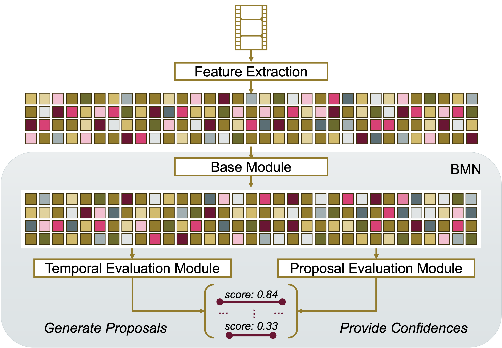
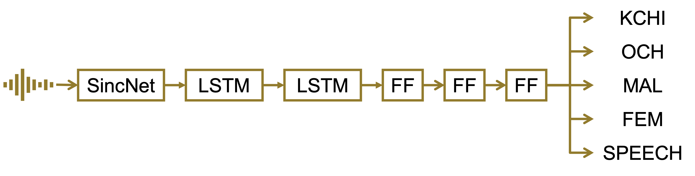
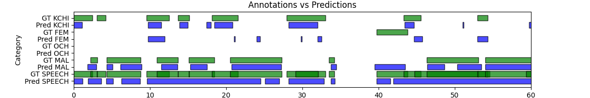

```{r setup, include = FALSE}
library(papaja)
library(tidyverse)
library(ggplot2)
library(brms)
library(ggthemes)
library(ggpubr)
library(BayesFactor)
library(broom)
library(coda)
library(reshape2)
library(ggridges)
library(readxl)
library(dplyr)
library(lubridate)
library(zoo)
library(gridExtra)
library(grid)
library(kableExtra)
library(cowplot)
library(patchwork)
library(magick)
library(ggplotify)


estimate_mode <- function(s) {
  d <- density(s)
  return(d$x[which.max(d$y)])
}

hdi_upper<- function(s){
  m <- HPDinterval(mcmc(s))
  return(m["var1","upper"])
}

hdi_lower<- function(s){
  m <- HPDinterval(mcmc(s))
  return(m["var1","lower"])
}
```

```{r analysis-preferences}
# Seed for random number generation
set.seed(42)
knitr::opts_chunk$set(cache.extra = knitr::rand_seed)
knitr::opts_chunk$set(echo = F, warning = F, message = F)
```

# Introduction
In developmental psychology, everyday experiences are crucial for shaping children’s development [@piagetPartCognitiveDevelopment1964; @vygotskyMindSocietyDevelopment1978; @rogoffImportanceUnderstandingChildrens2018; @carpendaleWhatMakesUs2020; @smithDevelopingInfantCreates2018; @tomaselloCulturalOriginsHuman2009; @heyesCognitiveGadgetsCultural2018]. Fundamental theories, such as Piaget’s Learning Theory of Cognitive Development [@piagetPartCognitiveDevelopment1964], have long recognized the role of everyday interactions in helping children actively construct knowledge, while Vygotsky’s Sociocultural Theory [@vygotskyMindSocietyDevelopment1978] emphasized how social interactions help transform everyday sensory experiences into structured understanding. Building on these foundational insights, more recent studies have further explored how everyday experiences shape cognitive and social development. For instance, Spangler [@spanglerToddlersEverydayExperiences1989] showed that toddlers’ daily interactions shape their mental and emotional dispositions, predicting later developmental outcomes. Similarly, Tomasello’s Cultural Learning Theory [@tomaselloCulturalOriginsHuman2009] pointed out how everyday social interactions, particularly those involving shared intentionality, foster uniquely human cognitive abilities by enabling children to understand others’ intentions and perspectives. Further expanding on this, Heyes’s work on the Cultural Evolution of Thinking [@heyesCognitiveGadgetsCultural2018] highlighted the importance of experiences like imitation and informal social learning in developing cognitive capacities. Debarbaro et al. [@debarbaroTenLessonsInfants2022] summarized various studies, emphasizing the need to analyze infants’ dynamic, diverse experiences captured through everyday activity sensors, and stressed the significance of long-term analysis to understand developmental patterns and variability. Despite this growing body of work, direct research connecting the diversity of children’s daily experiences to broader developmental trajectories remains limited. While many studies focus on specific domains such as language or social cognition, there remains a need for more comprehensive investigations into how diverse daily experiences shape developmental trajectories.

In the context of children’s developmental trajectories, research has focused on areas like language acquisition, theory of mind, and social cognition, utilizing a range of methods and data sources. For instance, Donnelly et al. [@donnellyLongitudinalRelationshipConversational2021] used audio-only data to explore the relationship between conversational turn-taking and vocabulary growth in children, while Roy et al. [@royPredictingBirthSpoken2015] examined how words used in specific contexts are learned more easily, emphasizing the importance of multimodal contexts. In contrast, Rowe [@roweDifferencesEarlyGesture2009] leveraged video data to investigate how gestures at 14 months predict vocabulary development in children from different socioeconomic backgrounds. Ruffman et al. [@ruffmanExposureBehavioralRegularities2023] used head-mounted video cameras to study how repeated behaviors in everyday life correlate with the acquisition of mental state vocabulary, supporting the minimalist view of theory of mind development. Bergelson [@bergelsonEverydayLanguageInput2023], on the other hand, used large-scale audio data to explore the impact of adult speech on children’s language production across diverse cultural contexts. These studies demonstrate the value of both audio and video data in understanding children’s development, yet they highlight the need for datasets that capture the full diversity of children’s everyday experiences.

A significant challenge in this field is the extensive amount of data needed to comprehensively study children’s daily lives. Traditional methods, such as manual annotation, are time-consuming and impractical for large-scale datasets. To address this, computational models offer scalable solutions for analyzing social interactions and behaviors. For instance, OpenPose [@caoOpenPoseRealtimeMultiPerson2018] allows the tracking of human body, face, and hand poses, providing insights into gestures and engagement. YOLOv8 [@redmonYouOnlyLook2015] offers efficient object detection for analyzing children’s interactions with their environment, while models like I3D [@carreiraQuoVadisAction2017] provide an automataed solution for classifying activities in video data. For audio, Wave2Vec 2.0 [@baevskiWav2vec20Framework2020] provides robust speech-to-text and speech representation capabilities, enabling the study of conversational dynamics. Together, these models facilitate the efficient analysis of multimodal data, but their improvement and development depend on the availability of diverse, high-quality datasets. A notable example of such a dataset is ImageNet [@russakovskyImageNetLargeScale2014], which has been crucial in advancing computer vision models. Similarly, expanding publicly available datasets in developmental psychology could accelerate progress in studying children’s everyday experiences. 

Several publicly available datasets have made valuable contributions to our understanding of children’s social and communicative behavior. For example, the SAYCam dataset [@sullivanSAYCamLargeLongitudinal2021] provides audio-video recordings from infants (6–32 months) who wore head-mounted cameras over two years, capturing naturalistic speech and behaviors. Similarly, the DAMI-P2C dataset [@chenDyadicAffectParentChild2023] includes audio and video recordings of parent-child interactions during story reading, with annotations for body movements in a controlled environment. The MMDB dataset [@rehgDecodingChildrensSocial2013] offers multimodal data (audio, video, physiological) of children (15–30 months) engaged in semi-structured play interactions, recorded in a lab. Another example is the UpStory dataset [@fraileUpStoryUppsalaStorytelling2024], which features audio and video of primary school children (8-10 years) in dyadic storytelling interactions, also recorded in a lab setting. Additionally, the BabyView dataset [@longBabyViewDatasetHighresolution2024] provides high-resolution, egocentric video of children aged 6 months to 5 years, recorded at home and in preschool environments, with annotations for speech transcription and pose estimation. While these datasets vary in age, setting, and target behaviors, they collectively highlight the need for more naturalistic, at-home datasets that can capture the full range of children’s daily activities.

To address this gap, we introduce the publicly available ChildLens dataset, which focuses on activity annotations for children aged 3–5 years and captures their naturalistic experiences at home. The dataset consists of 106 hours of video and audio recordings collected from 61 children wearing camera-equipped vests. It includes detailed activity annotations for five location classes and 14 activity classes, categorizing activities based on whether the child is interacting alone or with others. These annotations, labeled with start and end times, provide a granular view of children’s everyday behaviors, crucial for understanding their developmental trajectories. Designed to support research in developmental psychology and computer vision, the ChildLens dataset offers a rich resource for advancing multimodal learning and studying the full spectrum of children’s daily activities.

# Dataset Overview

#### Activity Classes
The ChildLens dataset includes 14 activity classes and 5 location classes. The activity classes are categorized based on the child’s interactions within the video and can be divided into _person-only_ activities (e.g. "child talking", "other person talking"), and _person-object_ activities (e.g. "drawing", "playing with object"). A brief description of each class can be found in the appendix. These activities are further categorized into _audio-based_, _visual-based_, and _multimodal_ activities, as presented in Figure \@ref(fig:camera-superannotate-activity-classes). Below is an overview of the different activity types:

- **Audio-based activities**: _child talking_, _other person talking_, _overheard speech_, _singing / humming_, _listening to music / audiobook_
- **Visual-based activities**: _watching something_, _drawing_, _crafting things_, _dancing_
- **Multimodal activities**: _playing with object_, _playing without object_, _making music_, _pretend play_, _reading book_ 


The location classes describe the current location of the child in the video and include _livingroom_, _playroom_, _bathroom_, _hallway_, and _other_.

```{r camera-superannotate-activity-classes, echo=FALSE, dpi=600, fig.align='center', fig.cap="\\textbf{A} – Vest with the embedded camera worn by the children, \\textbf{B} – SuperAnnotate platform utilized for video annotation, \\textbf{C} – Activity classes in the ChildLens dataset."}
img1 <- ggdraw() + draw_image("images/camera_worn_close.png", scale = 0.8)
img2 <- ggdraw() + draw_image("images/SuperAnnotate.png", scale = 0.8)
img3 <- ggdraw() + draw_image("images/ChildLens_activity_classes.png", scale = 1)

# Combine img1 and img2 into the first row with equal heights
top_row <- (img1 + img2) + 
  plot_layout(widths = c(0.4, 1))

final_layout <- (top_row / img3) +
  plot_layout(heights = c(1, 1))  # Adjust row heights if needed

# Add labels (A), (B), (C) to the images
final_labeled_layout <- final_layout +
  plot_annotation(tag_levels = 'A')  # Adds "A", "B", "C" automatically

# Display the final layout
final_labeled_layout
```
#### Statistics

```{r video-statistics, echo=FALSE, message=FALSE, warning=FALSE}
data <- read_csv2("data/ChildLens_data_sheet.csv")
subject_infos <- read_csv2("data/ChildLens_subjects.csv")
subject_infos <- subject_infos %>%
  distinct(ID, .keep_all = TRUE)

unique_data <- data %>%
  filter(!is.na(Minutes_per_ID), Minutes_per_ID != 0, 
         !is.na(ID), Labeled == "yes") %>%
  distinct(ID, Minutes_per_ID, .keep_all = TRUE)
unique_data <- unique_data %>%
  mutate(ID = as.double(ID))

cleaned_data <- data %>%
  filter(!is.na(Minutes_per_ID), Minutes_per_ID != 0, 
         !is.na(ID), Labeled == "yes")
sum_videos <- nrow(cleaned_data)

data_gender_count <- unique_data %>%
  left_join(subject_infos, by = "ID") %>%
  distinct(ID, .keep_all = TRUE)
male_count <- data_gender_count %>%
  filter(gender == "Male") %>%
  nrow()
female_count <- data_gender_count %>%
  filter(gender == "Female") %>%
  nrow()

data_age_count <- cleaned_data %>%
  left_join(subject_infos, by = "ID")%>%
  select(ID, birthday, Date)

data_age_count <- data_age_count %>%
  mutate(
    birthday = dmy(birthday),  # Convert birthday to Date type
    Date = dmy(Date),          # Convert Date to Date type
    Age = as.numeric(difftime(Date, birthday, units = "weeks")) / 52.25,  # Calculate age in years
    Age_group = case_when(
      Age >= 3 & Age < 4 ~ "3+",
      Age >= 4 & Age < 5 ~ "4+",
      Age >= 5 ~ "5+",
      TRUE ~ NA_character_  # For cases where age is missing or not within the desired ranges
    )
  )

mean_age <- mean(data_age_count$Age, na.rm = TRUE)
sd_age <- sd(data_age_count$Age, na.rm = TRUE)

age_group_counts <- data_age_count %>%
  count(Age_group, name = "count")
count_3_plus <- age_group_counts$count[age_group_counts$Age_group == "3+"]
count_4_plus <- age_group_counts$count[age_group_counts$Age_group == "4+"]
count_5_plus <- age_group_counts$count[age_group_counts$Age_group == "5+"]

filtered_data <- data %>%
  filter(!is.na(Date), Labeled == "yes") %>%
  mutate(Date = as.Date(Date, format = "%d.%m.%Y")) 

min_minutes <- min(unique_data$Minutes_per_ID[unique_data$Minutes_per_ID > 0], na.rm = TRUE)
max_minutes <- max(unique_data$Minutes_per_ID, na.rm = TRUE)
sum_minutes <- sum(unique_data$Minutes_per_ID, na.rm = TRUE)
mean_minutes <- mean(unique_data$Minutes_per_ID, na.rm = TRUE)
sd_minutes <- sd(unique_data$Minutes_per_ID, na.rm = TRUE)

sum_hours <- sum_minutes/60
nr_children <- nrow(unique_data)

oldest_date <- min(filtered_data$Date)
youngest_date <- max(filtered_data$Date)

oldest_year <- as.numeric(format(oldest_date, "%Y"))
oldest_month <- as.numeric(format(oldest_date, "%m"))
youngest_year <- as.numeric(format(youngest_date, "%Y"))
youngest_month <- as.numeric(format(youngest_date, "%m"))

# Calculate the interval between the two dates
time_span_months <- (youngest_year - oldest_year) * 12 + (youngest_month - oldest_month)+1
```

The ChildLens dataset comprises of `r sum_videos` video files with a total of `r sum_hours` hours recorded by `r nr_children` children aged 3 to 5 years (M=`r mean_age`, SD=`r sd_age`). This includes `r count_3_plus` videos from children aged 3, `r count_4_plus` videos from children aged 4, and `r count_5_plus` videos from children aged 5. The video duration per child varies between `r min_minutes` and `r max_minutes` minutes (M=`r mean_minutes`, SD=`r sd_minutes`). A detailed distribution of the video duration per child is shown in figure \@ref(fig:minutes-per-child). 

This diverse dataset includes a varying number of instances across the 14 activity classes, with each class containing between  2 and 319 instances per class. The duration of each instance varies by activity. For instance, audio-based activities like "child talking" may last only a few seconds, while activities like "reading a book" can span several minutes. The table with the total number of instances and summed duration for all activity classes is available in the appendix.

```{r minutes-per-child-density, echo=FALSE, message=FALSE, warning=FALSE, eval=FALSE}
unique_data$ID <- as.factor(unique_data$ID)

ggplot(unique_data, aes(x = Minutes_per_ID)) +
  geom_histogram(binwidth = 10) +
  scale_y_continuous(breaks = scales::pretty_breaks(n = 10), labels = scales::label_number(accuracy = 1)) +
  labs(x = "Minutes per ID", y = "Count") +
  theme_minimal()
```

```{r age-distribution, echo=FALSE, message=FALSE, warning=FALSE, eval=FALSE, fig.cap="Number of videos per age group."}
data_age_count_plot <- data_age_count
data_age_count_plot$ID <- as.factor(data_age_count_plot$ID)

ggplot(data_age_count_plot, aes(x = Age_group, fill = Age_group)) +
  geom_bar(position = "dodge", alpha = 0.7, width = 0.5) +
  scale_fill_manual(values = c("3+" = "#A6ADAF", "4+" = "#A18D92", "5+" = "#BBBB9B")) + 
  theme_minimal() +
  labs(
    x = "Age Group",
    y = "Count",
    fill = "Age Group"
  ) +
  theme(legend.position = "none")

plot_age <- ggplot(data_age_count_plot, aes(x = Age_group, fill = Age_group)) +
  geom_bar(position = "dodge", alpha = 0.7, width = 0.5) +
  scale_fill_manual(values = c("3+" = "#B7B794", "4+" = "#8A8A8A", "5+" = "#B7AD94")) + 
  theme(
    legend.position = "none",
    axis.title = element_text(size = 25),      # Increase label size
    axis.text = element_text(size = 25),       # Increase tick label size
    axis.ticks.length = unit(0.5, "cm")        # Increase tick size
  ) +  labs(
    x = "Age Group",
    y = "Count",
    fill = "Age Group"
  ) +
  theme(legend.position = "none")

# Specify the file path and name
output_folder <- "/Users/nelesuffo/Promotion/projects/leuphana-IPE/paper/images" 
file_name <- "video_count_per_age_group.png"
file_path <- file.path(output_folder, file_name)

# Save the plot
ggsave(filename = file_path, plot = plot_age, width = 8, height = 6, dpi = 300)
```

```{r minutes-per-child, echo=FALSE, message=FALSE, warning=FALSE, fig.cap="Video recording duration (in minutes) per child ID.", fig.height=2.5, fig.width=3.5}
unique_data$ID <- as.factor(unique_data$ID)

ggplot(unique_data, aes(x = Minutes_per_ID)) +
  geom_point(aes(y = 0), shape = "I", size = 4) + 
  geom_density(fill = "gray", alpha = 0.5, color = "black") + 
  theme_minimal() +
  theme(legend.position = "none") +
  labs(
    x = "Minutes per ID",
    y = "Density"
  )

#unique_data$ID <- as.factor(unique_data$ID)

#plot <- ggplot(unique_data, aes(x = Minutes_per_ID)) +
#  geom_point(aes(y = 0), shape = "I", size = 5) + 
#  geom_density(fill = "gray", alpha = 0.5, color = "black") + 
 # theme_minimal() +
 # theme(
  #  legend.position = "none",
   # axis.title = element_text(size = 25),      # Increase label size
    #axis.text = element_text(size = 25),       # Increase tick label size
    #axis.ticks.length = unit(0.5, "cm")        # Increase tick size
  #) +
  #labs(
  #  x = "Minutes per ID",
  #  y = "Density"
  #)

# Specify the file path and name
#output_folder <- "/Users/nelesuffo/Promotion/projects/leuphana-IPE/paper/images" 
#file_name <- "minutes_per_id_plot.png"
#file_path <- file.path(output_folder, file_name)

# Save the plot
#ggsave(filename = file_path, plot = plot, width = 3, height = 2, dpi = 100)
```

#### Data Access
The ChildLens dataset will be made available for research purposes, providing a rich resource for studying children’s daily activities and interactions. The dataset includes video and audio recordings, annotations, and activity labels. Due to the sensitive nature of the data, which includes recordings of children in home, access will be restricted. The dataset will be accessible through a dedicated website (**mock-link.com**), where researchers can submit requests for access. All requests will be carefully reviewed before access is granted to ensure proper handling and compliance with privacy standards. Please contact **person** to request access to the dataset.

#### Exhaustive multi-label annotations
The dataset provides detailed annotations for each video file. These annotations specify the child’s current location within the video, the start and end times of each activity, the activity class, and whether the child is engaged alone or with somebody else. For every person involved in the activity, we capture age and gender. If multiple activities occur simultaneously in a video, each activity is individually labeled. For example, if a segment shows a child “reading a book” while also “talking,” two separate annotations are created: one for “reading a book” and another for “child talking.” This exhaustive labeling strategy ensures that each activity is accurately represented in the dataset. 

# Dataset Generation
This section outlines the steps taken to create the ChildLens dataset. We provide detailed information on the video collection process, the labeling strategy employed, and the generation of activity labels.

## Step 1: Collection of Egocentric Videos
The ChildLens dataset consists of egocentric videos recorded by children aged 3 to 5 years over a period of `r time_span_months` months. A total of `r nr_children` children from families living in a mid-sized city in Germany, participated in the study. The videos were captured at home using a camera embedded in a vest worn by the children, as shown in figure \@ref(fig:camera-superannotate-activity-classes). This setup allowed the children to move freely throughout their homes while recording their activities. The camera, a _PatrolEyes WiFi HD Infrared Police Body Camera_, was equipped with a 140-degree wide-angle lens and captured everything within the child's field of view with a resolution of 1920x1080p at 30 fps. The camera also recorded audio, allowing us to capture the child's speech and other sounds in the environment. Additionally, the parents were handed a small checklist of activities to record, ensuring that a variety of activities were represented in the videos. The focus was on capturing everyday activities that children typically engage in. Parents were therefore asked to include the following elements in the recordings:

- Child spends time in different rooms and performs various activities in each room
- Child is invited to read a book together with an adult
- Child is invited to play with toys alone
- Child is invited to play with toys with someone else (adult or child)
- Child is invited to draw/craft something

## Step 2: Creation of Labeling Strategy
To create a comprehensive labeling strategy for the ChildLens dataset, we first defined a list of activities that children typically engage in. This list was based on previous research on child development and the activities that children are known to participate in. We then developed a detailed catalog of activities that were likely to be captured in the videos and chose to make the activity classes more granular by distinguishing between activities like "making music" and "singing/humming" or "drawing" and "crafting things". 

After an initial review of the videos, we decided to add another class "overheard speech" to capture situations in which the child is not directly involved in a conversation but can hear it. We also added "pretend play" as a separate class to capture situations in which the child is engaged in imaginative play. This approach allowed us to capture the diversity of activities that children engage in and create a comprehensive dataset for activity analysis.

## Step 3: Manual Labeling Process
Before the actual annotation process, a setup meeting was held to introduce the annotators to the labeling strategy. To familiarize themselves with the task, the annotators were assigned 25 sample videos to practice and gain hands-on experience. These initial annotations were reviewed by the research team, and feedback was provided to refine the approach. A total of three feedback loops were conducted to ensure that the annotators follow the labeling strategy properly.

The videos were manually annotated by native German speakers who watched each video and labeled the activities present in the footage. Annotators marked the start and end points of each activity. For audio annotations, we implemented a 2-second rule for the categories ‘other person talking’ and ‘child talking’: if the break between two utterances was 2 seconds or less, it was considered a single event; breaks longer than 2 seconds split the activity into separate instances. The annotations were conducted using the SuperAnnotate platform, as shown in figure \@ref(fig:camera-superannotate-activity-classes), allowing for efficient annotation and review of the videos.

# Benchmark Performance
In this chapter, we present the results of applying two model architectures to the ChildLens dataset. While the dataset supports multimodal activity analysis, we focus on two specific tasks: temporal activity localization using video data and voice type classification using audio data. For temporal activity localization, we use the Boundary-Matching Network (BMN) model, a state-of-the-art approach in this domain, and train it from scratch on the unique activity classes in the ChildLens video data. For voice type classification, we apply the Voice Type Classifier (VTC) [@lavechinOpensourceVoiceType2020], also state-of-the-art, which was trained on similar data. Both models provide initial results and establish a benchmark for future research. 

```{r bmn-architecture, dpi=600, fig.align='center', eval=FALSE, fig.cap="Boundary Matching Network architecture applied to ChildLens video data"}

#A short architecture overview of the models is presented in figure \@ref(fig:bmn-architecture) and figure \@ref(fig:vtc-architecture).
```

```{r vtc-architecture, dpi=600, fig.align='center', eval=FALSE, fig.cap="Voice Type Classifier architecture applied to ChildLens audio data"}

```

## Boundary-Matching Network (BMN)
We employ the Boundary-Matching Network (BMN) [@linBMNBoundaryMatchingNetwork2019] for temporal activity localization on our dataset. BMN generates action proposals by predicting activity start and end boundaries and classifying these proposals into activity classes. The architecture consists of two main components: (1) a proposal generation network, which identifies candidate proposals, and (2) a proposal classification network, which classifies these proposals. The model prioritizes proposals with high recall and high temporal overlap with ground truth.
BMN performance is evaluated using Average Recall (AR) and Area Under the Curve (AUC) metrics. AR is computed at various Intersection over Union (IoU) thresholds and for different Average Numbers of Proposals (AN) as AR@AN, where AN ranges from 0 to 100. AR@100 reflects recall performance with 100 proposals per video, while AUC quantifies the trade-off between recall and number of generated proposal On the ActivityNet-1.3 test set, BMN achieves an AR@100 of 72.46 and an AUC of 64.47, demonstrating its effectiveness in activity localization.

### Data Preparation
The BMN implementation, including video preprocessing and model training, was conducted using the MMAction2 toolbox [@mmaction2contributorsOpenMMLabsNextGeneration2020]. Data preparation involved several key steps, such as raw frame extraction and the generation of both RGB and optical flow features for each video. Before training the model, we analyzed the distribution of activity instances across the classes to assess the data’s sufficiency for both training and testing. A detailed summary of the activity instances and their total durations can be found in the appendix.

Our analysis highlighted a significant class imbalance in the dataset, both in terms of instance count and the total duration of recordings. Given the primary goal of establishing initial benchmark results, no data augmentation methods were employed to mitigate this imbalance. Instead, the focus was placed on the more frequent activity classes, which also had the longest durations: “Playing with Object” (22.85 hours of recording), “Drawing” (6.24 hours of recording), and “Reading a Book” (5.48 hours of recording).

For feature extraction and model training optimization, the videos were divided into clips of 4000 frames each (correspond to approx. 2 minutes and 13 seconds). This resulted in a total of 1130 clips. However, only 995 clips had annotations, so we split these annotated clips into training, validation, and test subsets, using an 80-10-10 split. The training set was used for model optimization, the validation set guided hyperparameter tuning and overfitting prevention, and the test set was reserved for evaluating the model’s generalization ability on unseen data.

### Implementation Details
The BMN model was trained from scratch on the ChildLens dataset to predict the start and end boundaries of activity classes in the videos. The model was implemented using MMAction2, an open-source toolbox for video understanding based on PyTorch [@mmaction2contributorsOpenMMLabsNextGeneration2020]. Training took place on a Linux server with 48 cores and 187 GB of RAM. The Adam optimizer was used with a learning rate of 0.001 and a batch size of 4. To avoid overfitting, early stopping based on validation loss was applied during training.

### Evaluation
The performance of the BMN model on the ChildLens dataset, compared to its evaluation on ActivityNet-1.3, is summarized in Table \@ref(tab:bmn-results), with AR@100 and AUC reported for both datasets. The results indicate that the BMN model generalizes well to new domains, such as children’s everyday activities, despite the ChildLens dataset’s focus on social and behavioral interactions in naturalistic settings. These benchmark results highlight the potential for integrating the ChildLens dataset with existing models like BMN. Automating the analysis of this dataset can streamline the study of children’s activities and interactions, facilitating more efficient research in developmental psychology and related fields.

```{r bmn-results, echo=FALSE, message=FALSE, warnings=FALSE, results='asis', eval=TRUE}
my.data <- "Dataset           | AR@100  | AUC
            ActivityNet-1.3   | 72.46   | 64.47
            ChildLens         | 77.43   | 69.21"


df <- read.delim(textConnection(my.data), header=FALSE, sep="|", strip.white=TRUE, stringsAsFactors=FALSE)

# Set the column names
names(df) <- unname(as.list(df[1,]))
df <- df[-1,]  # Remove the first row with column names
row.names(df) <- NULL


# Print the updated table
apa_table(
  df,
  caption = "Comparison of BMN performance on the ActivityNet-1.3 dataset (used for model evaluation) and the ChildLens dataset, highlighting the Average Recall for 100 proposals (AR@100) and the Area Under the Curve (AUC).",
  escape = TRUE
)
```
  
## Voice Type Classifier (VTC)
The Voice Type Classifier [@lavechinOpensourceVoiceType2020] (VTC) is a state-of-the-art model designed to classify audio rawfiles into five distinct voice types: `Key Child (KCHI)`, `Other Child (CHI)`, `Male Speech (MAL)`, `Female Speech (FEM)`, and `Speech (SPEECH)`. Its architecture processes audio by first dividing it into 2-second chunks, which are passed through a SincNet to extract low-level features. These features are then fed into a stack of two bi-directional LSTMs, followed by three feed-forward layers. The output layer uses a sigmoid activation function to produce a score between 0 and 1 for each class. The VTC is trained on 260 hours of audio material obtained from different child-centered audio datasets. Model evaluation is performed by utilizing the \( F_1 \)-measure, which combines precision and recall using the following formula: 
\[
F_1 = 2 \cdot \frac{\text{precision} \cdot \text{recall}}{\text{precision} + \text{recall}}
\]
where \(\text{precision} = \frac{\text{tp}}{\text{tp} + \text{fp}}\) and  \(\text{recall} = \frac{\text{tp}}{\text{tp} + \text{fn}}\) with

- \(\text{tp}\) being the number of true positives,
- \(\text{fp}\) being the number of false positives, and
- \(\text{fn}\) being the number of false negatives.

It ranges from 0 to 1, with 1 representing perfect precision and recall, and 0 indicating no correct prediction The interpretation of the \( F_1 \) score depends on the specific application of the model. Generally, an \( F_1 \) score above 0.8 is considered good, while values above 0.9 are considered excellent. In some cases, a score around 0.5 can still be considered acceptable, depending on the balance between precision and recall. The \( F_1 \) score is computed for each class and averaged to provide an overall measure. No collar is applied to the evaluation, meaning that the predictions have to be exact to be considered correct. The model achieves an \( F_1 \)  score of 57.3, outperforming the previous state-of-the-art LENA model by 10.6 points.

```{r vtc-implementation}
#Test set: 343it [36:01,  6.30s/it]
#Test set: 343it [11:00,  1.93s/it]
#Test set: 343it [10:54,  1.91s/it]
#Test set: 343it [10:54,  1.91s/it]
#Test set: 343it [10:59,  1.92s/it]
#Test set: 343it [11:00,  1.92s/it]
vtc_minutes_run <- 5461/60
num_audio_files <- 343
```
### Data Preparation
Before applying the VTC to the ChildLens dataset, we mapped our audio-based activity classes to the VTC output classes to enable performance comparison. The following mapping strategy was applied:

- Child talking → **`Key Child`** & **`Speech`**
- Singing/Humming → **`Key Child`** & **`Speech`**
- Other person talking:
  - If `age = "Child"` → **`Other Child`** & **`Speech`**
  - If `age = "Adult"` & `gender = "Female"` → **`Female Speech`** & **`Speech`**
  - If `age = "Adult"` & `gender = "Male"` → **`Male Speech`** & **`Speech`**
- Overheard Speech → **`Speech`**

The activity class "Listening to music/audiobook" was not mapped to any VTC class, as it is not covered by the VTC model. The mapping process resulted in new numbers for the total durations for each VTC class, as shown in Table \@ref(tab:vtc-classes-statistics).

### Implementation Details
In our study, we utilized the Voice Type Classifier without additional training, as its existing training data closely resembled the ChildLens dataset. However, to align with our specific annotation strategy, we adjusted a key parameter. Specifically, we modified the `min_duration_off` parameter, which defines the minimum duration for which an active class must be inactive to be recognized as deactivated by the VTC. The default setting of 0.1 seconds often resulted in numerous short utterance segments. To adhere to the “2-second rule”—where utterances are combined if the pause between them is 2 seconds or less—we increased this parameter to 2.0 seconds. This adjustment ensured consistency with our annotation methodology and reduced the fragmentation of detected utterances.

```{r vtc-classes-statistics, echo=FALSE, message=FALSE, warnings=FALSE, results='asis', eval=TRUE}
my.data <- "       | KCHI | CHI  | MAL   | FEM  | SPEECH 
            Total Duration  | 731.16 | 40.29 | 114.18  | 280.53 | 1465.55"
df <- read.delim(textConnection(my.data), header=FALSE, sep="|", strip.white=TRUE, stringsAsFactors=FALSE)
names(df) <- unname(as.list(df[1,]))
df <- df[-1,] 
row.names(df) <- NULL
apa_table(
  df,
  caption = "Cumulative Duration (in minutes) of Utterances Categorized by Voice Type Class",
  escape = TRUE,
)

vtc_f1 <- 58.1
vtc_kchi <- 67.3
vtc_chi <- 78.4
vtc_mal <- 23.3
vtc_fem <- 40.8
vtc_speech <- 80.5
```

### Evaluation
Table \@ref(tab:vtc-results) presents the performance of the Voice Type Classifier (VTC) on the ChildLens dataset compared to the benchmark dataset from the original study. The VTC model achieves an average  \( F_1 \) score of `vtc_f1` on the ChildLens dataset, performing comparably to the benchmark dataset. It performs best on the `CHI` class with an  \( F_1 \)   score of **xx** and worst on the `MAL` class with an  \( F_1 \)  score of **xx** Compared to the benchmark dataset, the model performs significantly better on the `CHI` class but slightly worse on the `MAL` and `FEM` classes. Analysis of False Positives and False Negatives reveals that the most common confusion occurs between the `MAL` and `FEM` classes. This may be attributed to the deeper pitch of some female voices in the German language. Additionally, the model was trained on a dataset with a different language distribution and younger children, where adults, particularly females, may use a higher pitch when interacting with infants, unlike with older children.
Figure \@ref(fig:vtc-evaluations) provides a visual representation of the VTC predictions compared to the ground truth annotations.

```{r vtc-results, echo=FALSE, message=FALSE, warnings=FALSE, results='asis', eval=TRUE}
my.data <- "Dataset       | KCHI | CHI  | MAL   | FEM  | SPEECH | AVG
            ACLEW-Random  | 68.7 | 33.2 | 42.9  | 63.4 | 78.4   | 57.3
            ChildLens     | 67.3 | 78.4 | 23.3  | 40.8 | 80.5   | 58.1"
df <- read.delim(textConnection(my.data), header=FALSE, sep="|", strip.white=TRUE, stringsAsFactors=FALSE)
names(df) <- unname(as.list(df[1,]))
df <- df[-1,] 
row.names(df) <- NULL
apa_table(
  df,
  caption = "Comparison of VTC performance on the ACLEW-Random dataset (used for model evaluation) and the ChildLens dataset, highlighting the F1  measure for each class and the average F1 score",
  escape = TRUE,
)
```

```{r vtc-evaluations, dpi=180, fig.align='center', fig.cap="VTC Predictions compared to Ground Truth Annotations"}

```

# General Discussion
We present the ChildLens dataset, a unique egocentric video-audio dataset that documents children’s everyday experiences, spanning a wide age range of 3 to 5 years. This dataset is particularly distinctive due to its diversity in terms of the number of children it includes and the variety of activity labels it covers. By focusing on both visual and auditory data, the ChildLens dataset provides comprehensive annotations for a broad spectrum of key activities, offering rich insights into children’s social and behavioral interactions in naturalistic settings. This makes it a valuable resource for studying developmental processes in children, with a focus on their cognitive, emotional, and social growth.

In comparison to other freely available datasets, the ChildLens dataset stands out due to its broad age span and diverse set of activity labels. Most other datasets focus either on toddlers, are limited to dyadic interactions or were recorded in lab settings, with all of them lacking a comprehensive range of activity labels. Furthermore, most of these datasets either capture only audio or video, missing the multimodal aspect crucial for understanding children’s everyday experiences. In contrast, ChildLens includes naturalistic recordings from children’s home environments, over an extended period, and features a variety of activity types. The dataset also captures whether children are engaged in activities alone or with others and provides detailed demographic information about all individuals involved. This comprehensive approach enables a deeper and more holistic understanding of children’s interactions and developmental trajectories.

The usefulness of the ChildLens dataset is demonstrated by its successful application to well-established models. For example, the pretrained Voice-Type Classifier for audio transcription achieves performance comparable to previous datasets, while the Boundary-Matching Network (BMN) produces robust results for activity localization, consistent with its performance on other datasets. These results indicate that the ChildLens dataset’s annotations align well with model predictions, highlighting its quality and potential for multimodal research. Moreover, the successful application of these models demonstrates how the dataset can support and automate the analysis of children’s everyday activities.

Expanding the potential for multi-method approaches, activity localization could be further enhanced by incorporating object identification, allowing for better tracking of the objects children interact with during daily routines, as demonstrated in adult-focused studies [@kazakosLittleHelpMy2021]. Research by Bambach et al. [@bambachLendingHandDetecting2015] also emphasizes the importance of hand detection in egocentric video for activity recognition. Their work on using Convolutional Neural Networks for hand segmentation highlights how such techniques can differentiate activities, offering a deeper understanding of children’s interactions and behaviors.

The integration of visual and auditory data in the ChildLens dataset enables a more detailed and comprehensive understanding of children’s daily experiences. Complex activities such as pretend play and reading a book, which require both audio and video for accurate detection, exemplify the strength of this multimodal approach. While previous studies, such as those analyzing disfluencies in children’s speech during computer game play [@yildirimAutomaticDetectionDisfluency2009], have demonstrated that combining visual and auditory information can improve performance, few studies have explored this in the context of children’s naturalistic activities. With ChildLens, the combination of naturalistic data and multimodal analysis creates new opportunities for in-depth insights into children’s cognitive, emotional, and social development, particularly for activities best captured through both modalities.

Despite its strengths, one limitation of the ChildLens dataset is the class imbalance, especially in underrepresented activity classes, which could affect model training and evaluation. More frequent activities, such as “child talking” (7447 instances, 649 minutes) and “playing with object” (317 instances, 1371 minutes), dominate the dataset, while less common activities like “dancing” (2 instances, 0.57 minutes) and “making music” (2 instances, 2.13 minutes) are scarcely represented. Similarly, activities like “pretend play” (59 instances, 158.84 minutes) and “reading a book” (81 instances, 328.70 minutes) appear less frequently. This imbalance may lead to skewed model performance, making it harder to accurately classify rare activities. Possible solutions to this challenge could involve merging rare activity classes into broader categories or excluding them from model training, though these approaches may reduce the dataset’s diversity. Other methods, such as resampling or augmentation, could help balance the dataset and improve model performance [@spelmenReviewHandlingImbalanced2018; @alaniClassifyingImbalancedMultimodal2020].

In addition to class imbalance, another potential limitation is the sampling bias. Since the recordings are largely influenced by parental decisions about when and how often activities are captured, certain activities or settings may be overrepresented or underrepresented based on these preferences. Furthermore, the dataset primarily focuses on families from a mid-sized German city, limiting its geographic and cultural diversity. Expanding the dataset to include a broader range of families from different regions and cultures would enhance its generalizability and applicability to various research contexts.

The study of children’s everyday experiences is crucial for understanding their cognitive, emotional, and social development. These daily interactions provide important insights into how children learn, grow, and engage with their environment. The ChildLens dataset makes a valuable contribution to this field by offering a rich multimodal resource that captures the complexities of children’s lives in naturalistic settings. With its comprehensive annotations and potential to automate the analysis of children’s activities, the dataset enables researchers to gain deeper and more detailed insights into children’s development. By making such analyses more efficient and accessible, the ChildLens dataset creates new opportunities for understanding the complexities of early childhood development and provides a foundation for future research in this area.

\newpage
# References
<!--e used `r cite_r("bibliography.bib")` for all our analyses.-->    
```{r create_r-references}
r_refs(file = "bibliography.bib")
```

\begingroup
\setlength{\parindent}{-0.5in}
\setlength{\leftskip}{0.5in}

<div id = "refs"></div>
\endgroup

\newpage
# Appendix

## List of ChildLens Activity Classes

The dataset contains the following list of activities.

1. **playing with object**: The child is playing with an object, such as a toy or a ball.
2. **playing without object**: The child is playing without an object, such as playing hide and seek or catch.
3. **pretend play**: The child is engaged in imaginative play, such as pretending to be a doctor or a firefighter.
4. **watching something**: The child is watching a movie, TV show, or video on either a screen or a device.
5. **reading book**: The child is reading a book or looking at pictures in a book.
6. **child talking**: The child is talking to themselves or to someone else.
7. **other person talking**: Another person is talking to the child.
8. **overheard speech**: Conversations that the child can hear but is not directly involved in.
9. **drawing**: The child is drawing or coloring a picture.
10. **crafting things**: The child is engaged in a craft activity, such as making a bracelet or decoration.
11. **singing / humming**: The child is singing or humming a song or a melody.
12. **making music**: The child is playing a musical instrument or making music in another way.
13. **dancing**: The child is dancing to music or moving to a rhythm.
14. **listening to music / audiobook**: The child is listening to music or an audiobook.

## List of ChildLens Location Classes

1. livingroom
2. playroom
3. bathroom
4. hallawy
5. other

## Activity Class Statistics
```{r activity-classes-statistics, echo=FALSE, dpi=600, fig.align='center'}
# Define the table data as a string with "|" delimiters
activity_data <- "Category | Activity Class | Instance Count | Total Duration (min)
       Audio   | Child talking        | 7447             | 649.10
               | Other person talking | 6113             | 455.29
               | Overheard Speech     | 1898             | 299.44
               | Singing/Humming      | 277             | 82.00
               | Listening to music/audiobook | 68     | 222.14
       Video   | Watching something   | 2             | 5.09
               | Drawing              | 62             | 374.91
               | Crafting things      | 26             | 109.14
               | Dancing              | 2             | 0.57
      Multimodal | Playing with object  | 317             | 1371.06
                 | Playing without object | 25           | 28.87
                 | Pretend play         | 59             | 158.84
                 | Reading a book         | 81             | 328.70
                 | Making music         | 3             | 2.13"
# Read the table into a data frame
activity_classes_table <- read.delim(
  textConnection(activity_data), 
  header = FALSE, 
  sep = "|", 
  strip.white = TRUE, 
  stringsAsFactors = FALSE
)

# Assign column names from the first row
names(activity_classes_table) <- unname(as.list(activity_classes_table[1, ]))

# Remove the first row (header row) from the data frame
activity_classes_table <- activity_classes_table[-1, ]

# Reset row names to NULL
row.names(activity_classes_table) <- NULL

# Use apa_table to display the table with a caption
apa_table(
  activity_classes_table,
  caption = "Number of video instances and the total duration (in minutes).",
  escape = TRUE
)
```

```{r quantex-statistics, echo=FALSE, message=FALSE, warning=FALSE}
quantex_data <- read_csv2("data/Quantex_data_sheet.csv")
quantex_subject_infos <- read_csv2("data/Quantex_subjects.csv")
quantex_subject_infos <- quantex_subject_infos %>%
  distinct(ID, .keep_all = TRUE)

quantex_unique_data <- quantex_data %>%
  distinct() %>%  # Removes duplicate rows
  filter(!is.na(Minutes_per_ID), Minutes_per_ID != 0, 
         !is.na(ID), Include == "yes") %>%
  distinct(ID, Minutes_per_ID, .keep_all = TRUE)
quantex_unique_data <- quantex_unique_data %>%
  mutate(ID = as.double(ID))

quantex_cleaned_data <- quantex_data %>%
  filter(!is.na(Minutes_per_ID), Minutes_per_ID != 0, 
         !is.na(ID), Include == "yes")
quantex_sum_videos <- nrow(quantex_cleaned_data)

quantex_data_gender_count <- quantex_unique_data %>%
  left_join(quantex_subject_infos, by = "ID") %>%
  distinct(ID, .keep_all = TRUE)
quantex_male_count <- quantex_data_gender_count %>%
  filter(gender == "Male") %>%
  nrow()
quantex_female_count <- quantex_data_gender_count %>%
  filter(gender == "Female") %>%
  nrow()

quantex_data_age_count <- quantex_cleaned_data %>%
  left_join(quantex_subject_infos, by = "ID")%>%
  select(ID, birthday, DATE)

quantex_data_age_count <- quantex_data_age_count %>%
  mutate(
    birthday = dmy(birthday),  # Convert birthday to Date type
    Date = dmy(DATE),          # Convert Date to Date type
    Age = as.numeric(difftime(Date, birthday, units = "weeks")) / 52.25,  # Calculate age in years
    Age_group = case_when(
      Age >= 2 & Age < 4 ~ "3+",
      Age >= 4 & Age < 5 ~ "4+",
      Age >= 5 ~ "5+",
      TRUE ~ NA_character_  # For cases where age is missing or not within the desired ranges
    )
  )

quantex_mean_age <- mean(data_age_count$Age, na.rm = TRUE)
quantex_sd_age <- sd(data_age_count$Age, na.rm = TRUE)

quantex_age_group_counts <- quantex_data_age_count %>%
  count(Age_group, name = "count")
count_3_plus <- quantex_age_group_counts$count[quantex_age_group_counts$Age_group == "3+"]
count_4_plus <- quantex_age_group_counts$count[quantex_age_group_counts$Age_group == "4+"]
count_5_plus <- quantex_age_group_counts$count[quantex_age_group_counts$Age_group == "5+"]

quantex_filtered_data <- quantex_data %>%
  filter(!is.na(Date), Include == "yes") %>%
  mutate(Date = as.Date(DATE, format = "%d.%m.%Y")) 

quantex_min_minutes <- min(quantex_unique_data$Minutes_per_ID[quantex_unique_data$Minutes_per_ID > 0], na.rm = TRUE)
quantex_max_minutes <- max(quantex_unique_data$Minutes_per_ID, na.rm = TRUE)
quantex_sum_minutes <- sum(as.numeric(quantex_unique_data$Minutes_per_ID), na.rm = TRUE)
quantex_mean_minutes <- mean(quantex_unique_data$Minutes_per_ID, na.rm = TRUE)
quantex_sd_minutes <- sd(quantex_unique_data$Minutes_per_ID, na.rm = TRUE)
# Convert the time strings into seconds
quantex_unique_data$Seconds_per_ID <- as.numeric(hms::as_hms(quantex_unique_data$Minutes_per_ID))
total_seconds <- sum(quantex_unique_data$Seconds_per_ID, na.rm = TRUE)
total_hours <- total_seconds / 3600

quantex_nr_children <- nrow(quantex_unique_data)

quantex_oldest_date <- min(quantex_filtered_data$Date)
quantex_youngest_date <- max(quantex_filtered_data$Date)

quantex_oldest_year <- as.numeric(format(quantex_oldest_date, "%Y"))
quantex_oldest_month <- as.numeric(format(quantex_oldest_date, "%m"))
quantex_youngest_year <- as.numeric(format(quantex_youngest_date, "%Y"))
quantex_youngest_month <- as.numeric(format(quantex_youngest_date, "%m"))

# Calculate the interval between the two dates
quantex_time_span_months <- (quantex_youngest_year - quantex_oldest_year) * 12 + (quantex_youngest_month - quantex_oldest_month)+1
```

```{r quantex-minutes-per-child, echo=FALSE, message=FALSE, warning=FALSE, eval=FALSE}
quantex_unique_data$ID <- as.factor(quantex_unique_data$ID)

ggplot(quantex_unique_data, aes(x = Minutes_per_ID)) +
  geom_point(aes(y = 0), shape = "I", size = 5) + 
  geom_density(fill = "gray", alpha = 0.5, color = "black") + 
  theme_minimal() +
  theme(legend.position = "none") +
  labs(
    x = "Minutes per ID",
    y = "Density"
  )
quantex_1_plot <- ggplot(quantex_unique_data, aes(x = Minutes_per_ID)) +
  geom_point(aes(y = 0), shape = "I", size = 5) + 
  geom_density(fill = "gray", alpha = 0.5, color = "black") + 
  theme_minimal() +
  theme(
    legend.position = "none",
    axis.title = element_text(size = 25),      # Increase label size
    axis.text = element_text(size = 25),       # Increase tick label size
    axis.ticks.length = unit(0.5, "cm")        # Increase tick size
  ) +
  labs(
    x = "Minutes per ID",
    y = "Density"
  )

# Specify the file path and name
quantex_1_output_folder <- "/Users/nelesuffo/Promotion/projects/leuphana-IPE/paper/images" 
file_name_1 <- "quantex_minutes_per_id_plot.png"
quantex_file_path_1 <- file.path(quantex_1_output_folder, file_name_1)

# Save the plot
ggsave(filename = quantex_file_path_1, plot = quantex_1_plot, width = 8, height = 6, dpi = 300)
```

```{r quantex-age-distribution, echo=FALSE, message=FALSE, warning=FALSE, eval=FALSE, fig.cap="Number of videos per age group."}
quantex_data_age_count_plot <- quantex_data_age_count
quantex_data_age_count_plot$ID <- as.factor(quantex_data_age_count_plot$ID)

ggplot(quantex_data_age_count_plot, aes(x = Age_group, fill = Age_group)) +
  geom_bar(position = "dodge", alpha = 0.7, width = 0.5) +
  scale_fill_manual(values = c("3+" = "#A6ADAF", "4+" = "#A18D92", "5+" = "#BBBB9B")) + 
  theme_minimal() +
  labs(
    x = "Age Group",
    y = "Count",
    fill = "Age Group"
  ) +
  theme(legend.position = "none")

quantex_2_plot_age <- ggplot(quantex_data_age_count_plot, aes(x = Age_group, fill = Age_group)) +
  geom_bar(position = "dodge", alpha = 0.7, width = 0.5) +
  scale_fill_manual(values = c("3+" = "#66787C", "4+" = "#A18D92", "5+" = "#B2BFC3")) + 
  theme(
    legend.position = "none",
    axis.title = element_text(size = 25),      # Increase label size
    axis.text = element_text(size = 25),       # Increase tick label size
    axis.ticks.length = unit(0.5, "cm")        # Increase tick size
  ) +  labs(
    x = "Age Group",
    y = "Count",
    fill = "Age Group"
  ) +
  theme(legend.position = "none")

# Specify the file path and name
quantex_2_output_folder <- "/Users/nelesuffo/Promotion/projects/leuphana-IPE/paper/images" 
quantex_2_file_name <- "quantex_video_count_per_age_group.png"
quantex_2_file_path <- file.path(quantex_2_output_folder, quantex_2_file_name)

# Save the plot
ggsave(filename = quantex_2_file_path, plot = quantex_2_plot_age, width = 8, height = 6, dpi = 300)
```