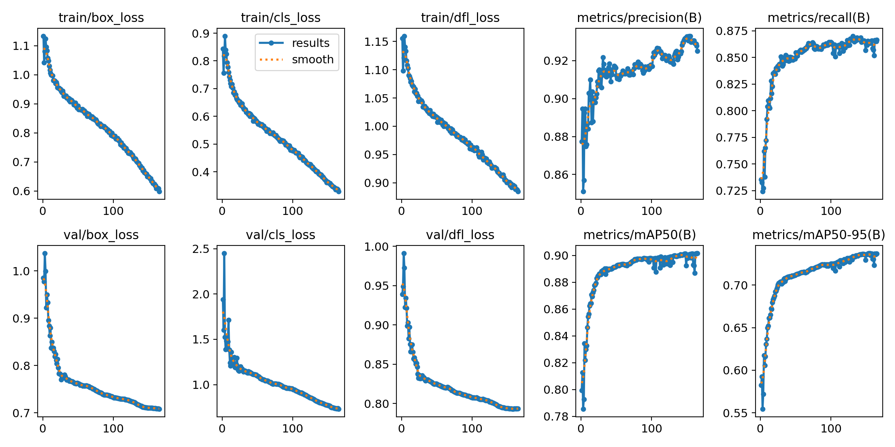

```{r setup, include = FALSE}
library(papaja)
library(tidyverse)
library(ggplot2)
library(brms)
library(ggthemes)
library(ggpubr)
library(BayesFactor)
library(broom)
library(coda)
library(reshape2)
library(ggridges)
library(readxl)
library(dplyr)
library(lubridate)
library(zoo)
library(gridExtra)
library(grid)
library(kableExtra)
library(cowplot)
library(patchwork)
library(magick)
library(ggplotify)
library(png)
library(jpeg)


estimate_mode <- function(s) {
  d <- density(s)
  return(d$x[which.max(d$y)])
}

hdi_upper<- function(s){
  m <- HPDinterval(mcmc(s))
  return(m["var1","upper"])
}

hdi_lower<- function(s){
  m <- HPDinterval(mcmc(s))
  return(m["var1","lower"])
}
```

```{r analysis-preferences}
# Seed for random number generation
set.seed(42)
knitr::opts_chunk$set(cache.extra = knitr::rand_seed)
knitr::opts_chunk$set(echo = F, warning = F, message = F)
```
```{r quantex-statistics, echo=FALSE, message=FALSE, warning=FALSE}
quantex_data <- read_csv2("data/Quantex_data_sheet.csv")
quantex_subject_infos <- read_csv2("data/Quantex_subjects.csv")
quantex_subject_infos <- quantex_subject_infos %>%
  distinct(ID, .keep_all = TRUE)

quantex_unique_data <- quantex_data %>%
  distinct() %>%  # Removes duplicate rows
  filter(!is.na(Minutes_per_ID), Minutes_per_ID != 0, 
         !is.na(ID), Include == "yes") %>%
  distinct(ID, Minutes_per_ID, .keep_all = TRUE)
quantex_unique_data <- quantex_unique_data %>%
  mutate(ID = as.double(ID))

quantex_cleaned_data <- quantex_data %>%
  filter(!is.na(Minutes_per_ID), Minutes_per_ID != 0, 
         !is.na(ID), Include == "yes")
quantex_sum_videos <- nrow(quantex_cleaned_data)

quantex_data_gender_count <- quantex_unique_data %>%
  left_join(quantex_subject_infos, by = "ID") %>%
  distinct(ID, .keep_all = TRUE)
quantex_male_count <- quantex_data_gender_count %>%
  filter(gender == "Male") %>%
  nrow()
quantex_female_count <- quantex_data_gender_count %>%
  filter(gender == "Female") %>%
  nrow()

quantex_data_age_count <- quantex_cleaned_data %>%
  left_join(quantex_subject_infos, by = "ID")%>%
  select(ID, birthday, DATE)

quantex_data_age_count <- quantex_data_age_count %>%
  mutate(
    birthday = dmy(birthday),  # Convert birthday to Date type
    Date = dmy(DATE),          # Convert Date to Date type
    Age = as.numeric(difftime(Date, birthday, units = "weeks")) / 52.25,  # Calculate age in years
    Age_group = case_when(
      Age >= 2 & Age < 4 ~ "3+",
      Age >= 4 & Age < 5 ~ "4+",
      Age >= 5 ~ "5+",
      TRUE ~ NA_character_  # For cases where age is missing or not within the desired ranges
    )
  )

quantex_mean_age <- mean(quantex_data_age_count$Age, na.rm = TRUE)
quantex_sd_age <- sd(quantex_data_age_count$Age, na.rm = TRUE)

quantex_age_group_counts <- quantex_data_age_count %>%
  count(Age_group, name = "count")
quantex_count_3_plus <- quantex_age_group_counts$count[quantex_age_group_counts$Age_group == "3+"]
quantex_count_4_plus <- quantex_age_group_counts$count[quantex_age_group_counts$Age_group == "4+"]
quantex_count_5_plus <- quantex_age_group_counts$count[quantex_age_group_counts$Age_group == "5+"]

quantex_filtered_data <- quantex_data %>%
  filter(!is.na(Date), Include == "yes") %>%
  mutate(Date = as.Date(DATE, format = "%d.%m.%Y")) 

quantex_min_minutes <- min(quantex_unique_data$Minutes_per_ID[quantex_unique_data$Minutes_per_ID > 0], na.rm = TRUE)
quantex_max_minutes <- max(quantex_unique_data$Minutes_per_ID, na.rm = TRUE)
quantex_sum_minutes <- sum(as.numeric(quantex_unique_data$Minutes_per_ID), na.rm = TRUE)
quantex_mean_minutes <- mean(quantex_unique_data$Minutes_per_ID, na.rm = TRUE)
quantex_sd_minutes <- sd(quantex_unique_data$Minutes_per_ID, na.rm = TRUE)

quantex_sum_hours <- quantex_sum_minutes/60

# Convert the time strings into seconds
quantex_unique_data$Seconds_per_ID <- as.numeric(hms::as_hms(quantex_unique_data$Minutes_per_ID))
total_seconds <- sum(quantex_unique_data$Seconds_per_ID, na.rm = TRUE)
total_hours <- total_seconds / 3600

quantex_nr_children <- nrow(quantex_unique_data)

quantex_oldest_date <- min(quantex_filtered_data$Date)
quantex_youngest_date <- max(quantex_filtered_data$Date)

quantex_oldest_year <- as.numeric(format(quantex_oldest_date, "%Y"))
quantex_oldest_month <- as.numeric(format(quantex_oldest_date, "%m"))
quantex_youngest_year <- as.numeric(format(quantex_youngest_date, "%Y"))
quantex_youngest_month <- as.numeric(format(quantex_youngest_date, "%m"))

# Calculate the interval between the two dates
quantex_time_span_months <- (quantex_youngest_year - quantex_oldest_year) * 12 + (quantex_youngest_month - quantex_oldest_month)+1

quantex_nr_annotated_videos <- 100
quantex_nr_train_frames <- 72687
quantex_nr_val_frames <- 7720
quantex_nr_test_frames <- 9272
quantex_nr_train_videos <- 51
quantex_nr_val_videos <- 6
quantex_nr_test_videos <- 7

```

# Introduction
According to various developmental psychologists, children’s everyday experiences play a vital role in their development [@piagetPartCognitiveDevelopment1964; @vygotskyMindSocietyDevelopment1978; @rogoffImportanceUnderstandingChildrens2018; @carpendaleWhatMakesUs2020; @smithDevelopingInfantCreates2018; @tomaselloCulturalOriginsHuman2009; @heyesCognitiveGadgetsCultural2018]. Everyday interactions, in particular, have been recognized for decades as crucial in the process of actively constructing knowledge [@piagetPartCognitiveDevelopment1964] and in transforming sensory experiences into structured understanding [@vygotskyMindSocietyDevelopment1978]. Building upon these foundational theories, more recent research has examined the mechanisms of social interaction further. For instance, @tomaselloCulturalOriginsHuman2009 introduced the concept of shared intentionality, illustrating how collaborative activities enable children to comprehend others’ intentions and perspectives, leading to cooperative behaviors and cultural learning .

Whereas theoretical frameworks and controlled laboratory studies have significantly advanced our understanding of children’s social development, they often fail to capture the complexities of interactions occurring in naturalistic settings. Observing children in their everyday environments offers a more authentic view of their social behaviors; however, this approach presents challenges due to the extensive data collection and analysis required.

To address these challenges, researchers have increasingly turned to data-driven approaches that utilize sensors and recording devices to gather objective data on social interactions. For instance, @onnelaUsingSociometersQuantify2014 employed wearable sensors to analyze social interactions in adult work settings, capturing the duration of close proximity between individuals. The study inferred that women were more talkative than men and more likely to be physically close to other women in group settings. @rossanoHow24yearold2022 examined social interactions among 31 two- to four-year-olds using 563 hours of video and audio recordings from a preschool during free play sessions over seven days. Manual interaction labels revealed that four-year-olds engaged in more cooperative social interactions and experienced fewer conflicts than two-year-olds, with object play and conversations being the most common forms of social engagement in both age groups. @daiLongitudinalDataCollection2022 investigated social interactions of 174 preschool children over three years, collecting voice and proximity data using wearable wireless RFID tags to study the co-development of social interactions and language acquisition. They employed manually labeled interaction data to train a temporal segment model that automatically identified periods of free play or class play, concluding that classmates frequently engaged in both contexts. @lemaignanPInSoRoDatasetSupporting2018 created a dataset comprising 45 hours of manually labeled social interactions between 45 child-child pairs and 30 child-robot pairs, including video and audio recordings, 3D facial data, skeletal information, and game interactions. By not providing specific instructions to the children, the researchers aimed to capture interactions in naturalistic settings. However, each laboratory session was limited to 40 minutes.

While these studies have advanced our understanding of social interactions, they often focus on controlled environments or are constrained by limited observation periods. Moreover, the manual data collection and analysis involved remain labor-intensive and time-consuming, and the current body of research lacks comprehensive data-driven studies analyzing children’s social interactions within their home environments.

To overcome these limitations, our study investigates social interactions in naturalistic home settings over an extended period. We have created the **Quantex** dataset which currently includes  `r quantex_sum_hours` hours of egocentric video and audio recordings from children aged 3 to 5 years and enables the analysis of specific patterns of social interactions, including:

- Presence of Individuals: Utilizing Yolo11 for person detection to identify when others are present in the child’s environment.
- Presence of Faces: Employing Yolo11 face detection to recognize faces the child encounters.
- Object Interactions: Analyzing the objects with which the child interacts using Yolo11 object detection
- Gaze Behaviors: Classifying gaze direction to determine when others are looking at the child.
- Speech Dynamics: Implementing voice type classification to differentiate between the child’s speech and that of others, distinguishing between peers and adults.
	
The primary objectives of this study are to quantify interaction patterns by measuring the frequency and duration of each identified interaction type, both individually and in combination. Additionaly we compare these patterns across different age groups within the 3 to 5-year range to identify developmental variations and milestones. Understanding these interaction patterns can inform developmental psychology about the actual nature of social interactions in children’s everyday lives.

# Methodology
This chapter outlines the methodology used in this study to collect, annotate, and analyze video and audio recordings of children’s everyday interactions. The aim of the study is to investigate key aspects of social interactions and engagement, such as the presence of persons, faces, gaze direction, and objects the child interacts with. The following sections provide a detailed description of the data collection process, the structure and characteristics of the dataset, the annotation strategy, and the preprocessing applied to the data prior to analysis. Additionally, an overview of the automated analysis pipeline is provided, giving details about the models used for person and face detection, gaze classification, object detection, and the application of a pre-trained voice type classifier. 


## Data Collection
This study collected egocentric video recordings from `r quantex_nr_children` children, aged 3 to 5 years, over a span of `r quantex_time_span_months` months. Participating families lived in a mid-sized city in Germany. Data collection is ongoing, and the number of children will continue to increase as the study progresses. The data collection process was approved by the local ethics committee, and all participating families provided written informed consent, allowing the researchers to use the data for scientific purposes. In accordance with data privacy regulations, every child was assigned a unique anonymized ID to protect their identity. Moreover, the video recordings are stored on a secure server and are only accessible to the research team, all of whom have signed confidentiality agreements.

To capture the children’s everyday experiences, a wearable vest equipped with a _PatrolEyes WiFi HD Infrared Police Body Camera_ was used (Figure \@ref(fig:camera-cvat-activity-classes)). The camera recorded high-definition video (1920x1080p at 30 fps) with a 140-degree wide-angle lens and also captured audio. The children were free to move around and engage in their usual activities at home without any interference or instructions given to their parents. 

As of now, the ongoing data collection process has resulted in a total of `r quantex_sum_videos` video recordings, with a combined duration of `r quantex_sum_hours` hours.

## Dataset Overview
The Quantex dataset includes video and audio recordings from `r quantex_nr_children` children aged 3 to 5 years (M=`r quantex_mean_age`, SD=`r quantex_sd_age`). The dataset contains `r quantex_count_3_plus` videos from three-year-olds, `r quantex_count_4_plus` videos from four-year-olds, and `r quantex_count_5_plus` videos from five-year-olds. The number of videos per child varies, as parents decide when and how often to record. The recording duration per child ranges from `r quantex_min_minutes` to `r quantex_max_minutes` minutes (M=`r quantex_mean_minutes`, SD=`r quantex_sd_minutes`). The total duration of all video recordings in the dataset is `r quantex_sum_hours` hours. Figure \@ref(fig:quantex-minutes-per-child) shows the distribution of video duration per child.

```{r quantex-minutes-per-child, echo=FALSE, message=FALSE, warning=FALSE, fig.align='center', fig.cap="Video recording duration (in minutes) per Child in the Quantex Dataset.", fig.height=2.5, fig.width=3.5}
quantex_unique_data$ID <- as.factor(quantex_unique_data$ID)

ggplot(quantex_unique_data, aes(x = Minutes_per_ID)) +
  geom_point(aes(y = 0), shape = "I", size = 5) + 
  geom_density(fill = "gray", alpha = 0.5, color = "black") + 
  theme_minimal() +
  theme(legend.position = "none") +
  labs(
    x = "Minutes per ID",
    y = "Density"
  )
quantex_1_plot <- ggplot(quantex_unique_data, aes(x = Minutes_per_ID)) +
  geom_point(aes(y = 0), shape = "I", size = 5) + 
  geom_density(fill = "gray", alpha = 0.5, color = "black") + 
  theme_minimal() +
  theme(
    legend.position = "none",
    axis.title = element_text(size = 25),      # Increase label size
    axis.text = element_text(size = 25),       # Increase tick label size
    axis.ticks.length = unit(0.5, "cm")        # Increase tick size
  ) +
  labs(
    x = "Minutes per ID",
    y = "Density"
  )

# Specify the file path and name
# <- "/Users/nelesuffo/Promotion/projects/leuphana-IPE/paper/images" 
#file_name_1 <- "quantex_minutes_per_id_plot.png"
#quantex_file_path_1 <- file.path(quantex_1_output_folder, file_name_1)

# Save the plot
#ggsave(filename = quantex_file_path_1, plot = quantex_1_plot, width = 8, height = 6, dpi = 300)
```

## Annotation Strategy
The dataset annotations cover four key elements: persons, faces, gaze direction, and objects the child interacts with. For each detected person (or reflection of a person, such as in a mirror) and face, additional attributes, such as age and gender, are collected. Gaze information indicates whether a detected person’s gaze is directed toward the child or not. Faces are annotated even when occluded or blurry to ensure comprehensive coverage of interactions. Partially visible faces are also annotated if key facial features, such as the nose, eyes, or mouth, remain identifiable. Objects are annotated only when the child is actively interacting with them. These objects are categorized into six distinct groups: book, screen, animal, food, toy, and kitchenware, with an additional category for other objects. The annotation strategy is summarized in Figure \@ref(fig:camera-cvat-activity-classes).

The annotations were generated manually by a team of human annotators. Each video was randomly assigned to an initial annotator, and then reviewed by a second annotator to ensure consistency and accuracy. This peer review process helped to identify and resolve discrepancies, ensuring high-quality annotations. 

```{r camera-cvat-activity-classes, echo=FALSE, dpi=600, fig.align='center', fig.cap="\\textbf{A} – Vest with the embedded camera worn by the children, \\textbf{B} – CVAT platform utilized for video annotation, \\textbf{C} – Annotation Strategy in the Quantex dataset."}
img1 <- ggdraw() + draw_image("images/camera_worn_close.png", scale = 0.8)
img2 <- ggdraw() + draw_image("images/cvat.png", scale = 0.8)
img3 <- ggdraw() + draw_image("images/quantex_annotation_strategy_narrow.png", scale = 0.9)

# Combine img1 and img2 into the first row with equal heights
top_row <- (img1 + img2) + 
  plot_layout(widths = c(0.4, 1))

final_layout <- (top_row / img3) +
  plot_layout(heights = c(1, 1))  # Adjust row heights if needed

# Add labels (A), (B), (C) to the images
final_labeled_layout <- final_layout +
  plot_annotation(tag_levels = 'A')  # Adds "A", "B", "C" automatically

# Display the final layout
final_labeled_layout
```

## Data Preprocessing
For the video data, the annotation strategy required persons, faces, and objects to be labeled even when only partially visible, as long as key features such as facial landmarks (e.g., nose, eyes, or mouth) or parts of a person or object were clearly visible. To prepare the video data for analysis, one frame per second was annotated, corresponding to every 30th frame in the video. This frame sampling was chosen to balance the need for a representative sample of the video while keeping the analysis manageable. Similarly, every 30th raw frame was extracted from the annotated video files for further processing. No preprocessing was applied to the audio data, which was used in its raw form for analysis.

## Automated Analysis Pipeline
Our automated analysis pipeline consists of four key modules: person and face detection, gaze classification, object detection, and voice type classification. Each module operates independently, utilizing separate machine learning models. Except for the voice type classifier, all models were trained on the Quantex dataset.

The pipeline follows a sequential process:
	1.	Person and face detection identifies the presence of individuals in the video frames.
	2.	Gaze classification determines whether detected faces are looking at the child.
	3.	Voice type classification detects the presence of speech and identifies whether the speaker is the key child, another child, or an adult.
	4.	Object detection provides insights into the types of objects children interact with, both in social and independent play contexts.

By integrating these modules, our pipeline enables a comprehensive analysis of children’s everyday experiences, capturing both social interactions and independent play

In the following sections, we describe each module in detail, including training data, model architecture, and evaluation metrics. A full technical analysis of each algorithm is provided in the [Supplementary Material].

### Person & Face Detection
	
### Gaze Classification

### Object Detection 

### Voice Detection and Classification


# Results

## Presence of Aspects of Social Interaction

### Presence of a Person

### Presence of a Face

### Presence of Gaze

### Presence of Language
## Co-occurrence of Aspects of Social Interaction 


# General Discussion

\newpage
# References

\newpage
# Supplementary Material
## Yolo11m: Person and Face Detection
```{r yolo-person-statistics, echo=FALSE, message=FALSE, warning=FALSE}
person_total_num_frames <- 113799
person_total_num_videos <- 80
person_num_frames_train <- 91038
person_class_to_total_ratio <- 45.25

num_person_frames_train <- 91038
num_person_frames_val <- 11379
num_person_frames_test <- 11382

person_tp <- 1905
person_fp <- 251
person_fn <- 234
person_tn <- num_person_frames_test - person_tp - person_fp - person_fn
person_fpr <- person_fp / (person_fp + person_tn) * 100
num_person <- person_fp + person_fn
per_wrong_person <- person_fp / person_tp * 100
person_recall <- 0.87
person_precision <- 0.92
person_f1_score <- 0.90

person_num_epochs <- 86
person_training_time <- 200
```

In our study, we utilized Ultralytics' YOLO11, the "latest iteration in the Ultralytics YOLO series of real-time object detectors" [@jocherUltralyticsYOLO112024], trained on the COCO dataset. Released in October 2024, YOLO11 introduces architectural improvements such as the C2PSA block (Convolutional Block with Parallel Spatial Attention), which enhances spatial attention within feature maps, allowing the model to focus more precisely on critical areas of an image compared to previous Yolo versions. Additionally, YOLO11 incorporates the C3K2 block, designed to be faster and more efficient, enhancing the overall performance of the feature aggregation process [@khanamYOLOv11OverviewKey2024]. These advancements make the YOLO11 detection model, pretrained on COCO, well-suited for training on our egocentric dataset, which captures dynamic movements from a camera perspective on chest height.

However, our dataset presents unique challenges due to the egocentric viewpoint, as the body parts of the child wearing the camera frequently appear in the footage. To prevent misclassification, we use a dedicated annotation scheme where all individuals in the scene are labeled as “person,” but each is assigned a unique ID. The key child, who wears the camera, is always assigned ID = 1. During preprocessing, we map the key child (ID = 1) into a separate category, “child body parts,” to distinguish their presence from other individuals. Since standard YOLO models do not inherently make this distinction, we fine-tune YOLO11m to recognize and differentiate between the key child’s body parts and other people. This adaptation ensures accurate person detection while minimizing false positives from the child’s own body, ultimately allowing for more precise analyses of social interactions. Additionally, YOLO11 does not include a predefined “face” class in its standard configuration, further underscoring the need for fine-tuning to meet the specific requirements of our dataset.

### Dataset Splitting
We started data preprocessing with a dataset comprising a total of `r person_total_num_frames` frames from `r person_total_num_videos` annotated videos. Prior to splitting this dataset into training, validation, and testing datasets, we analyzed the proportion of frames containing annotated persons as well as faces versus those without any annotations. Our analysis showed that at least one person was present in `r person_class_to_total_ratio`% of the frames and at least one face was visible in `r person_class_to_total_ratio`% of the frames. We applied a stratified split to ensure that each of the training, validation, and testing dataset preserved the original ratio of frames with persons, frames with faces to frames without any persons or faces. As a result, the final data distribution, displayed in detail in table \@ref(tab:person-dataset-splits)) consisted of `r num_person_frames_train` frames in the training dataset, `r num_person_frames_val` frames in the validation and `r num_person_frames_test` frames in the testing dataset, guaranteeing that the model's performance evaluation remained accurate to the real-world data distribution.

```{r person-dataset-splits, echo=FALSE, message=FALSE, warnings=FALSE, results='asis', eval=TRUE}
my.data <- "Quantex           | Percentage  | Training  | Validation  | Testing | Total
            Only Person(s)    | 30.19      | 27484     | 3435        | 3436    | 34355
            Only Face(s)      | 0.22       | 202       | 25          | 26      | 253
            Persons and Faces | 14.83      | 13506     | 1688        | 1689    | 16883
            No Person or Face | 54.75      | 49846     | 6230        | 6232    | 62308
            Total             |             | 91038     | 11378       | 11573   | 113799"

df <- read.delim(textConnection(my.data), header=FALSE, sep="|", strip.white=TRUE, stringsAsFactors=FALSE)

# Set the column names
names(df) <- unname(as.list(df[1,]))
df <- df[-1,]  # Remove the first row with column names
row.names(df) <- NULL


# Print the updated table
apa_table(
  df,
  caption = "Dataset splits for the YOLO11 person and face detection model trained on the Quantex dataset. The table shows the total number of frames, as well as the number of frames with only persons, only faces, both persons and faces, and no persons or faces in the training, validation, and testing datasets.",
  escape = TRUE
)
```
### Training and Convergence
Model training was conducted on a Linux server equipped with an Intel(R) Xeon(R) Silver 4214Y CPU @ 2.20GHz with 48 cores, a Quadro RTX 8000 GPU and 188 GB of RAM. The model was trained for a total of `r person_num_epochs` epochs, taking `r person_training_time` hours to complete. Training utilized YOLO11’s built-in data augmentation, an image size of 640, a batch size of 16, a cosine annealing learning rate scheduler [@loshchilovSGDRStochasticGradient2017], and early stopping after 10 epochs without improvement, with a maximum of 200 epochs.

The loss function of the YOLO11 model comprises three main components: Box Loss, Classification Loss, and Distribution Focal Loss (DFL) [@tervenLossFunctionsMetrics2024; @liGeneralizedFocalLoss2020]. _Box Loss_ quantifies the difference between predicted bounding boxes and ground truth boxes, ensuring precise localization of detected objects by penalizing inaccuracies in position and size. _Classification Loss_ evaluates the model’s ability to correctly assign detected objects to their respective classes, reducing false positives and false negatives. _Distribution Focal Loss_ enhances the model's ability to detect challenging objects, particularly small or partially occluded ones, by refining the localization of bounding box coordinates and emphasizing hard-to-detect instances. Together, these loss components contribute to a more robust and accurate detection model. 

During the training process, we observed that all three loss components decreased over time, indicating effective learning and improved performance, as visible in in figure \@ref(fig:person-loss-curves). A steady decrease in Box Loss indicates that the model is becoming increasingly accurate in localizing persons, faces and child body parts within frames. Similarly, the steady convergence of the Classification Loss reveals the model's increasing ability to reliably classifiy the detected object in either "person", "face" or "child body part". The decrease in DFL over time indicates that the model is getting better at focusing on and correctly identifying difficult-to-detect persons, faces or child body parts, which improves its overall detection capabilities. Conclusively, the loss curves show that the model effectively learned to localize and identify the target classes during the training period.

```{r person-loss-curves, fig.align='center', fig.cap="Training and Validation Loss Curves for the YOLO11 person detection model.", out.width="450px"}

```

### Model Evaluation Metrics
The YOLO11 model achieved a precision of `r person_precision` and a recall of `r person_recall` on the testing set, resulting in an F1-score of `r person_f1_score`. These metrics, summarized in table \@ref(tab:person-detection-metrics-detailed) indicate the model’s strong performance in accurately identifying faces while minimizing the number of missed detections and false positives. The precision-recall curve, displayed in figure \@ref(fig:person-metrics), further illustrates this performance, with the curve remaining close to the top-left corner. This positioning signifies that the model maintains high precision and recall across various thresholds, underscoring its effectiveness in detecting faces with confidence.

Analysis of the confusion matrix reveals that 86% of all faces are correctly identified by the model, corresponding to `r person_tp` true positives, while `r person_fn` faces were missed (false negatives). False negatives predominantly occurred in scenarios where faces were in the background, blurred due to motion, or occluded by the child’s body. In such instances, adjacent frames often provided clearer views, aiding in more accurate classification. The model exhibited a false positive rate of approximately `r person_fpr`%, with `r person_fp` frames incorrectly classified as containing faces when none were present. These false positives were often attributed to objects or toys resembling facial features. In face detection systems, achieving a balance between false positives and false negatives is crucial. Given this context, a 2.1% false positive rate is generally considered acceptable.

To provide a comprehensive understanding of the model’s performance, we have included visual examples of true positives, false positives, and false negatives in figure \@ref(fig:person-detection-examples). These images highlight the model’s strengths and areas where challenges persist, offering insights into specific scenarios that influence detection accuracy.

Overall, the YOLO11 model demonstrates robust performance in face detection tasks. However, challenges remain in dynamic scenarios, particularly with partially visible, rotated, or side-view faces. These findings underscore the complexities inherent in analyzing egocentric video data, where movement and varying perspectives introduce additional challenges.

```{r person-detection-metrics-detailed, echo=FALSE, message=FALSE, warnings=FALSE, results='asis', eval=TRUE}
my.data <- "Dataset | Precision | Recall | F1-Score | False Positive Rate | False Negative Rate
            Quantex | 0  | 0 | 0| 0 | 0"

df <- read.delim(textConnection(my.data), header=FALSE, sep="|", strip.white=TRUE, stringsAsFactors=FALSE)

# Set the column names
names(df) <- unname(as.list(df[1,]))
df <- df[-1,]  # Remove the first row with column names
row.names(df) <- NULL


# Print the updated table
apa_table(
  df,
  caption = "Evaluation metrics for the YOLO11m detection model trained on the Quantex dataset to detect persons and faces while distinguishing between the key child and other individuals. False Positive Rate and False Negative Rate are given in percentages.",
  escape = TRUE
)
```

```{r person-metrics, fig.align='center', fig.cap="\\textbf{A} - Confusion Matrix for the YOLO11 person and face detection model trained on the Quantex dataset. \\textbf{B} - Precision-Recall Curve for the YOLO11 person detection model."}
# Load images
img1 <- ggdraw() + draw_image("images/yolo_face_confusion_matrix.png", scale = 1)
img2 <- ggdraw() + draw_image("images/yolo_pf_precision_recall_curve.png", scale = 1.2)

# Combine img1 and img2 into the first row with equal heights
top_row <- (img1 + img2) + 
  plot_layout(widths = c(1, 1))

final_layout <- (top_row) +
  plot_layout(heights = c(1))  # Adjust row heights if needed

# Add labels (A), (B), (C) to the images
final_labeled_layout <- final_layout +
  plot_annotation(tag_levels = 'A')  # Adds "A", "B", "C" automatically

# Display the final layout
final_labeled_layout
```


```{r person-detection-examples, echo=FALSE, dpi=600, fig.align='center', fig.cap="\\textbf{A}, \\textbf{B} - Examples of True Positives, \\textbf{C}, \\textbf{D} – Examples of False Negatives, \\textbf{E}, \\textbf{F} – Examples of False Positives in the YOLO11 person detection model."}
img1 <- ggdraw() + draw_image("images/quantex_at_home_id255944_2022_03_07_01_002760.jpg", scale = 0.95)
img2 <- ggdraw() + draw_image("images/quantex_at_home_id255944_2022_03_07_01_002760.jpg", scale = 0.95)
img3 <- ggdraw() + draw_image("images/quantex_at_home_id255944_2022_03_07_01_002760.jpg", scale = 0.95)
img4 <- ggdraw() + draw_image("images/quantex_at_home_id255944_2022_03_07_01_002760.jpg", scale = 0.95)
img5 <- ggdraw() + draw_image("images/quantex_at_home_id255944_2022_03_07_01_002760.jpg", scale = 0.95)
img6 <- ggdraw() + draw_image("images/quantex_at_home_id255944_2022_03_07_01_002760.jpg", scale = 0.95)

# Combine img1 and img2 into the first row with equal heights
top_row <- (img1 + img2) + 
  plot_layout(widths = c(1, 1))

# Combine img1 and img2 into the first row with equal heights
middle_row <- (img3 + img4) + 
  plot_layout(widths = c(1, 1))

# Combine img1 and img2 into the first row with equal heights
bottom_row <- (img5 + img6) + 
  plot_layout(widths = c(1, 1))

final_layout <- (top_row / middle_row / bottom_row) +
  plot_layout(heights = c(1, 1, 1))  # Adjust row heights if needed

# Add labels (A), (B), (C) to the images
final_labeled_layout <- final_layout +
  plot_annotation(tag_levels = 'A')  # Adds "A", "B", "C" automatically

# Display the final layout
final_labeled_layout
```

## Yolo11m-cls: Gaze Classification
```{r gaze-statistics, echo=FALSE, message=FALSE, warning=FALSE}
total_num_gaze_frames <- 20889
gaze_total_num_videos <- 64
num_gaze_frames_train <- 73364
gaze_to_no_gaze_ratio <- 21.25

num_gaze_frames_train <- 16710
num_gaze_frames_val <- 2088
num_gaze_frames_test <- 2091

gaze_tp <- 1905
gaze_fp <- 251
gaze_fn <- 234
gaze_tn <- num_gaze_frames_test - gaze_tp - gaze_fp - gaze_fn
gaze_fpr <- gaze_fp / (gaze_fp + gaze_tn) * 100
num_gaze <- gaze_fp + gaze_fn
per_wrong_gaze <- gaze_fp / gaze_tp * 100
gaze_recall <- 0.88
gaze_precision <- 0.92
gaze_f1_score <- 0.90

gaze_num_epochs <- 165
gaze_training_time <- 283
```

In the gaze classification part of our study, we employed Ultralytics’ YOLO11 architecture [@jocherUltralyticsYOLO112024], more specifically the yolo11m classification model which is pretrained on ImageNet. The video data, collected from a camera on chest height, present unique challenges due to its egocentric perspective. This viewpoint sometimes introduced motion blur and the particular recoring angle can make it difficult to determine whether a person’s gaze is directed at the child, even for human annotators. We therefore defined to classify a person's gaze as “directed towards the child ” when the person's gaze is oriented towards the child's face, body, or in their general direction. This included cases where the person is looking directly at the camera, which is worn by the child, or slightly upward, estimating where the child’s head would be. For each face, we annotated the gaze as either directed at the child (“gaze”) or not (“no gaze”). Due to the architectural enhancements of YOLO11, such as the C2PSA block, which improves the model’s ability to focus on critical regions within an image, we chose YOLO11 for our gaze classification task and fine-tuned the pretrained Yolo11m model to classify gaze accordingly. 

### Dataset Splitting
For the gaze classification task, we utilized a subset of the Quantex dataset, focusing specifically on frames containing annotated faces. This subset comprised the cut-out faces extracted from the annotated face bounding boxes, resulting in `r total_num_gaze_frames` frames from `r gaze_total_num_videos` annotated videos. An analysis of each annotated face’s gaze property revealed that `r gaze_to_no_gaze_ratio`% of the faces were annotated as having gaze directed towards the child. Although the dataset is imbalanced, with “no gaze” as the majority class, we decided not to balance it, as too much data would have been lost, and the resulting dataset would have been too small. To preserve the existing gaze-to-no-gaze ratio, we instead employed a stratified sampling technique, ensuring proportional representation across the training, validation, and testing datasets. This approach resulted in the data distribution presented in Table @ref(tab:gaze-dataset-splits). Specifically, the training set comprised `r num_gaze_frames_train` frames, the validation set `r num_gaze_frames_val` frames, and the testing set `r num_gaze_frames_test` frames. By maintaining consistent class distribution across all subsets, we aimed to ensure that the model’s performance evaluation accurately reflects real-world data distributions.

```{r gaze-dataset-splits, echo=FALSE, message=FALSE, warnings=FALSE, results='asis', eval=TRUE}
my.data <- "Quantex   | Ratio  | Training  | Validation  | Testing | Total
            Gaze      | 21.25       | 3550      | 443         | 445     | 4438
            No Gaze   | 78.75       | 13160     | 1645        | 1646    | 16451
            Total     | 100.00      | 16710     | 2088        | 2091    | 20889"

df <- read.delim(textConnection(my.data), header=FALSE, sep="|", strip.white=TRUE, stringsAsFactors=FALSE)

# Set the column names
names(df) <- unname(as.list(df[1,]))
df <- df[-1,]  # Remove the first row with column names
row.names(df) <- NULL


# Print the updated table
apa_table(
  df,
  caption = "Dataset splits for the YOLO11 gaze classification model trained on the Quantex dataset. The table shows the total number of frames, as well as the number of frames with gaze and no gaze in the training, validation, and testing datasets. 'Gaze' indicates frames where the person's gaze is directed towards the child, while 'No Gaze' indicates frames where the person's gaze is not directed towards the child. Ratios are given in percentages.",
  escape = TRUE
)
```
### Training and Convergence
We trained the gaze classification model on the same linux server that was used for the person and face detection model training. The model was trained for a total of `r gaze_num_epochs` epochs, taking `r gaze_training_time` hours to complete. Similar to the person and face detection model, model training was conducted applying an image size of 640, a batch size of 16, a cosine annealing learning rate scheduler [@loshchilovSGDRStochasticGradient2017], and early stopping after 10 epochs without improvement, with a maximum of 200 epochs.

Figure \@ref(fig:person-loss-curves) provides an overview of the loss curves for the gaze classification model, showing the Box Loss, Classification Loss, and Distribution Focal Loss (DFL) over the training period. 
- tbd


### Model Evaluation Metrics


## Object Detection


## Voice Type Classification
Regarding the audio component of our interaction analysis, we aimed to use a model that not only detects the presence of speech but also distinguishes between the key child wearing the camera and other speakers. This distinction is crucial for understanding the dynamics of the interactions and the role of the key child in the social context. To achieve this, we applied the Voice Type Classifier [@lavechinOpensourceVoiceType2020], an open-source model designed to identify five different voice types: key child, other child, female adult, male adult, and speech in general. The model is based on a convolutional neural network (CNN) architecture and was trained on 260 hours of child-centered recordings across 10 different languages. 

Although the Quantex dataset does not include explicit audio labels, we are confident in the model’s suitability for our data. Prior testing on a similar labeled dataset which was also collected in our lab, ChildLens, demonstrated that the Voice Type Classifier achieved an F1 score of 58.1 (reference to ChildLens paper), which is comparable to the F1 score of 57.3 reported on the original training dataset. These results indicate that the model generalizes well to child-centered recordings, making it a reliable choice for our analysis.

We applied the Voice Type Classifier to the extracted audio data from the Quantex dataset using the code provided by the authors of the voice type classifier [@lavechinVoiceTypeClassifier2020]. The model was used to detect the presence of speech and classify the speaker into one of the five predefined categories.

\newpage
# References
<!--e used `r cite_r("bibliography.bib")` for all our analyses.-->    
```{r create_r-references}
r_refs(file = "bibliography.bib")
```

\begingroup
\setlength{\parindent}{-0.5in}
\setlength{\leftskip}{0.5in}

<div id = "refs"></div>
\endgroup

\newpage
# Appendix


