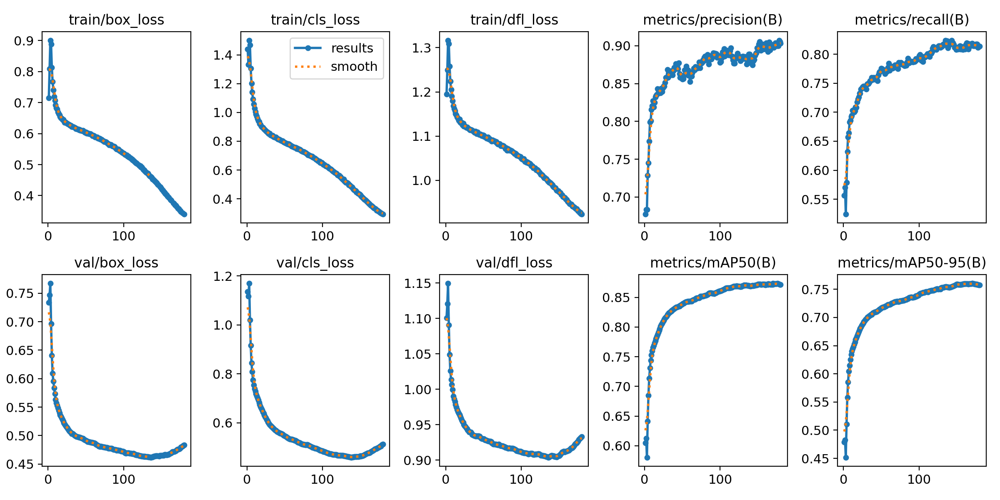

```{r setup, include = FALSE}
library(papaja)
library(tidyverse)
library(ggplot2)
library(brms)
library(ggthemes)
library(ggpubr)
library(BayesFactor)
library(broom)
library(coda)
library(reshape2)
library(ggridges)
library(readxl)
library(dplyr)
library(lubridate)
library(zoo)
library(gridExtra)
library(grid)
library(kableExtra)
library(cowplot)
library(patchwork)
library(magick)
library(ggplotify)
library(png)
library(jpeg)


estimate_mode <- function(s) {
  d <- density(s)
  return(d$x[which.max(d$y)])
}

hdi_upper<- function(s){
  m <- HPDinterval(mcmc(s))
  return(m["var1","upper"])
}

hdi_lower<- function(s){
  m <- HPDinterval(mcmc(s))
  return(m["var1","lower"])
}
```

```{r analysis-preferences}
# Seed for random number generation
set.seed(42)
knitr::opts_chunk$set(cache.extra = knitr::rand_seed)
knitr::opts_chunk$set(echo = F, warning = F, message = F)
```
```{r quantex-statistics, echo=FALSE, message=FALSE, warning=FALSE}
quantex_data <- read_csv2("data/Quantex_data_sheet.csv")
quantex_subject_infos <- read_csv2("data/Quantex_subjects.csv")
quantex_subject_infos <- quantex_subject_infos %>%
  distinct(ID, .keep_all = TRUE)

quantex_unique_data <- quantex_data %>%
  distinct() %>%  # Removes duplicate rows
  filter(!is.na(Minutes_per_ID), Minutes_per_ID != 0, 
         !is.na(ID), Include == "yes") %>%
  distinct(ID, Minutes_per_ID, .keep_all = TRUE)
quantex_unique_data <- quantex_unique_data %>%
  mutate(ID = as.double(ID))

quantex_cleaned_data <- quantex_data %>%
  filter(!is.na(Minutes_per_ID), Minutes_per_ID != 0, 
         !is.na(ID), Include == "yes")
quantex_sum_videos <- nrow(quantex_cleaned_data)

quantex_data_gender_count <- quantex_unique_data %>%
  left_join(quantex_subject_infos, by = "ID") %>%
  distinct(ID, .keep_all = TRUE)
quantex_male_count <- quantex_data_gender_count %>%
  filter(gender == "Male") %>%
  nrow()
quantex_female_count <- quantex_data_gender_count %>%
  filter(gender == "Female") %>%
  nrow()

quantex_data_age_count <- quantex_cleaned_data %>%
  left_join(quantex_subject_infos, by = "ID")%>%
  select(ID, birthday, DATE)

quantex_data_age_count <- quantex_data_age_count %>%
  mutate(
    birthday = dmy(birthday),  # Convert birthday to Date type
    Date = dmy(DATE),          # Convert Date to Date type
    Age = as.numeric(difftime(Date, birthday, units = "weeks")) / 52.25,  # Calculate age in years
    Age_group = case_when(
      Age >= 2 & Age < 4 ~ "3+",
      Age >= 4 & Age < 5 ~ "4+",
      Age >= 5 ~ "5+",
      TRUE ~ NA_character_  # For cases where age is missing or not within the desired ranges
    )
  )

quantex_mean_age <- mean(quantex_data_age_count$Age, na.rm = TRUE)
quantex_sd_age <- sd(quantex_data_age_count$Age, na.rm = TRUE)

quantex_age_group_counts <- quantex_data_age_count %>%
  count(Age_group, name = "count")
quantex_count_3_plus <- quantex_age_group_counts$count[quantex_age_group_counts$Age_group == "3+"]
quantex_count_4_plus <- quantex_age_group_counts$count[quantex_age_group_counts$Age_group == "4+"]
quantex_count_5_plus <- quantex_age_group_counts$count[quantex_age_group_counts$Age_group == "5+"]

quantex_filtered_data <- quantex_data %>%
  filter(!is.na(Date), Include == "yes") %>%
  mutate(Date = as.Date(DATE, format = "%d.%m.%Y")) 

quantex_min_minutes <- min(quantex_unique_data$Minutes_per_ID[quantex_unique_data$Minutes_per_ID > 0], na.rm = TRUE)
quantex_max_minutes <- max(quantex_unique_data$Minutes_per_ID, na.rm = TRUE)
quantex_sum_minutes <- sum(as.numeric(quantex_unique_data$Minutes_per_ID), na.rm = TRUE)
quantex_mean_minutes <- mean(quantex_unique_data$Minutes_per_ID, na.rm = TRUE)
quantex_sd_minutes <- sd(quantex_unique_data$Minutes_per_ID, na.rm = TRUE)

quantex_sum_hours <- quantex_sum_minutes/60

# Convert the time strings into seconds
quantex_unique_data$Seconds_per_ID <- as.numeric(hms::as_hms(quantex_unique_data$Minutes_per_ID))
total_seconds <- sum(quantex_unique_data$Seconds_per_ID, na.rm = TRUE)
total_hours <- total_seconds / 3600

quantex_nr_children <- nrow(quantex_unique_data)

quantex_oldest_date <- min(quantex_filtered_data$Date)
quantex_youngest_date <- max(quantex_filtered_data$Date)

quantex_oldest_year <- as.numeric(format(quantex_oldest_date, "%Y"))
quantex_oldest_month <- as.numeric(format(quantex_oldest_date, "%m"))
quantex_youngest_year <- as.numeric(format(quantex_youngest_date, "%Y"))
quantex_youngest_month <- as.numeric(format(quantex_youngest_date, "%m"))

# Calculate the interval between the two dates
quantex_time_span_months <- (quantex_youngest_year - quantex_oldest_year) * 12 + (quantex_youngest_month - quantex_oldest_month)+1

quantex_num_videos <- 634 # Total number of videos in the dataset
quantex_num_frames <- 19023571 # Total number of frames in the dataset
```

```{r yolo-person-statistics, echo=FALSE, message=FALSE, warning=FALSE}
 det_total_num_frames <- 113799
 det_total_num_videos <- 80
 det_num_frames_train <- 91038
 det_class_to_total_ratio <- 29.75
 
 num_det_frames_train <- 91039
 num_det_frames_val <- 11380
 num_det_frames_test <- 11380
 
 det_recall <- 0.79
 det_precision <- 0.89
 det_f1_score <- 0.84
 det_map <- 0.858
 det_recall <- 0.80
 det_precision <- 0.91
 det_f1_score <- 0.85
 det_map <- 0.870
 
 tp_child <- 0.81
 tp_adult <- 0.91
 tp_child_face <- 0.82
 tp_adult_face <- 0.91
 tp_child_body_parts <- 0.94
 tp_book <- 0.9
 tp_screen <- 0.93
 tp_toy <- 0.76
 tp_kitchenware <- 0.75
 tp_other_object <- 0.79
 
 fn_kitchenware <- 0.22
 fn_toy <- 0.22
 fn_other_object <- 0.19
 
 ap_toy <- 0.77
 ap_kitchenware <- 0.77
 ap_other_object <- 0.82
 
 det_num_epochs <- 86
 det_training_time <- 200
```

# Introduction 
According to various developmental psychologists, children’s everyday experiences play a vital role in their development [@piagetPartCognitiveDevelopment1964; @vygotskyMindSocietyDevelopment1978; @rogoffImportanceUnderstandingChildrens2018; @carpendaleWhatMakesUs2020; @smithDevelopingInfantCreates2018; @tomaselloCulturalOriginsHuman2009; @heyesCognitiveGadg; @fetsCultural2018]. Everyday interactions, in particular, have been recognized for decades as crucial in the process of actively constructing knowledge [@piagetPartCognitiveDevelopment1964] and in transforming sensory experiences into structured understanding [@vygotskyMindSocietyDevelopment1978]. Building upon these foundational theories, more recent research has examined the mechanisms of social interaction further. For instance, @tomaselloCulturalOriginsHuman2009 introduced the concept of shared intentionality, illustrating how collaborative activities enable children to comprehend others’ intentions and perspectives, leading to cooperative behaviors and cultural learning .

Whereas theoretical frameworks and controlled laboratory studies have significantly advanced our understanding of children’s social development, they often fail to capture the complexities of interactions occurring in naturalistic settings. Observing children in their everyday environments offers a more authentic view of their social behaviors; however, this approach presents challenges due to the extensive data collection and analysis required.

To address these challenges, researchers have increasingly turned to data-driven approaches that utilize sensors and recording devices to gather objective data on social interactions. For instance, @onnelaUsingSociometersQuantify2014 employed wearable sensors to analyze social interactions in adult work settings, capturing the duration of close proximity between individuals. The study inferred that women were more talkative than men and more likely to be physically close to other women in group settings. @rossanoHow24yearold2022 examined social interactions among 31 two- to four-year-olds using 563 hours of video and audio recordings from a preschool during free play sessions over seven days. Manual interaction labels revealed that four-year-olds engaged in more cooperative social interactions and experienced fewer conflicts than two-year-olds, with object play and conversations being the most common forms of social engagement in both age groups. @daiLongitudinalDataCollection2022 investigated social interactions of 174 preschool children over three years, collecting voice and proximity data using wearable wireless RFID tags to study the co-development of social interactions and language acquisition. They employed manually labeled interaction data to train a temporal segment model that automatically identified periods of free play or class play, concluding that classmates frequently engaged in both contexts. @lemaignanPInSoRoDatasetSupporting2018 created a dataset comprising 45 hours of manually labeled social interactions between 45 child-child pairs and 30 child-robot pairs, including video and audio recordings, 3D facial data, skeletal information, and game interactions. By not providing specific instructions to the children, the researchers aimed to capture interactions in naturalistic settings. However, each laboratory session was limited to 40 minutes.

While these studies have advanced our understanding of social interactions, they often focus on controlled environments or are constrained by limited observation periods. Moreover, the manual data collection and analysis involved remain labor-intensive and time-consuming, and the current body of research lacks comprehensive data-driven studies analyzing children’s social interactions within their home environments.

The present study investigates social interactions in naturalistic home settings over an extended period. The corresponding **Quantex** dataset currently includes  `r quantex_sum_hours` hours of egocentric video and audio recordings from children aged 3 to 5 years. Here we focus on specific patterns of social interactions, including:

- **Presence of Individuals**: Utilizing YOLO11 for person detection to identify when others are present in the child’s environment.
- **Presence of Faces**: Employing YOLO11 face detection to recognize faces the child encounters.
- **Object Interactions**: Analyzing the objects with which the child interacts using YOLO11 object detection
- **Gaze Behaviors**: Classifying gaze direction with YOLO11-cls to determine when others are looking at the child.
- **Person Proximity**: Estimating the distance between the child and others to quantify social engagement.
- **Speech Dynamics**: Implementing voice type classification to differentiate between the child’s speech and that of others, distinguishing between peers and adults.
	
The primary objectives of this study are to quantify interaction patterns by measuring the frequency of each identified interaction type, both individually and in combination. Additionaly, we compare these patterns across different age groups within the 3 to 5-year range to identify developmental variations and milestones. Understanding these interaction patterns can inform developmental psychology about the actual nature of social interactions in children’s everyday lives.

# Methodology {#methodology}
The following sections provide a detailed description of the data collection process, the structure and characteristics of the dataset, the annotation strategy, and the preprocessing applied to the data prior to analysis. Additionally, an overview of the automated analysis pipeline is provided, giving details about the models used for person, face and object detection, gaze classification, and the application of a pre-trained voice type classifier. 

## Participants Recruitment and Data Collection {#participants}
This study collected egocentric video recordings from `r quantex_nr_children` children, aged 3 to 5 years, over a span of `r quantex_time_span_months` months [MB: in addition, it would be interesting to know in what time intervall the videos were collected for each child, also a more detailed overview of the number of children per age group would be nice]. 

### Recruitment Process
Children were recruited from a mid-sized German city via an internal lab database, ensuring balanced age distribution (30% 3-year-olds, 35% 4-year-olds, 35% 5-year-olds). The study was approved by the ethics committee, and all families provided written consent. Parents received detailed study information via phone, and families agreeing to participate were given a vest with an embedded camera, which children were asked to wear for approximately two hours. Recordings were restricted to the home for privacy and securely stored on the MPI-EVA server. Parents could receive the camera via home delivery or self-pickup.

### Distribution of Study Materials and Instructions
At the handover, parents received one or two vests (various sizes), a charged camera unit, and detailed study/data protection information. They were trained on camera operation and encouraged to practice. The consent form listed the participating child and potential individuals captured. Parents were given five privacy information sheets to distribute as needed. A follow-up call was scheduled to ensure recording success, typically planned for the following weekend.

### Return of Equipment and Final Data Confirmation
Parents were contacted to confirm recording success, with flexible rescheduling if needed. Once completed, a pickup/drop-off appointment was arranged to collect the camera, vest, and consent form. Parents confirmed their email for receiving recordings. As a thank-you, children received a Labyrinth game.

## Materials {#materials}
To capture children’s everyday experiences, a wearable vest equipped with a _PatrolEyes WiFi HD Infrared Police Body Camera_ was used (see Figure \@ref(fig:camera-cvat-activity-classes)). The camera recorded high-definition video (1920x1080p at 30 fps) with a 140-degree wide-angle lens and also captured audio. Children were free to move around and engage in their usual activities at home without any interference or instructions given to their parents. 

## Dataset Overview {#dataset}
The Quantex dataset includes video and audio recordings from `r quantex_nr_children` children aged 3 to 5 years (M=`r quantex_mean_age`, SD=`r quantex_sd_age`). The dataset contains `r quantex_count_3_plus` videos from three-year-olds, `r quantex_count_4_plus` videos from four-year-olds, and `r quantex_count_5_plus` videos from five-year-olds. The number of videos per child varies, as parents decide when and how often to record. The recording duration per child ranges from `r quantex_min_minutes` to `r quantex_max_minutes` minutes (M=`r quantex_mean_minutes`, SD=`r quantex_sd_minutes`). The total duration of all video recordings in the dataset is `r quantex_sum_hours` hours. Figure \@ref(fig:quantex-minutes-per-child) shows the distribution of video duration per child.

```{r quantex-minutes-per-child, echo=FALSE, message=FALSE, warning=FALSE, fig.align='center', fig.cap="Video recording duration (in minutes) per Child in the Quantex Dataset.", fig.height=2.5, fig.width=3.5}
quantex_unique_data$ID <- as.factor(quantex_unique_data$ID)

ggplot(quantex_unique_data, aes(x = Minutes_per_ID)) +
  geom_point(aes(y = 0), shape = "I", size = 5) + 
  geom_density(fill = "gray", alpha = 0.5, color = "black") + 
  theme_minimal() +
  theme(legend.position = "none") +
  labs(
    x = "Minutes per ID",
    y = "Density"
  )
quantex_1_plot <- ggplot(quantex_unique_data, aes(x = Minutes_per_ID)) +
  geom_point(aes(y = 0), shape = "I", size = 5) + 
  geom_density(fill = "gray", alpha = 0.5, color = "black") + 
  theme_minimal() +
  theme(
    legend.position = "none",
    axis.title = element_text(size = 25),      # Increase label size
    axis.text = element_text(size = 25),       # Increase tick label size
    axis.ticks.length = unit(0.5, "cm")        # Increase tick size
  ) +
  labs(
    x = "Minutes per ID",
    y = "Density"
  )

# Specify the file path and name
# <- "/Users/nelesuffo/Promotion/projects/leuphana-IPE/paper/images" 
#file_name_1 <- "quantex_minutes_per_id_plot.png"
#quantex_file_path_1 <- file.path(quantex_1_output_folder, file_name_1)

# Save the plot
#ggsave(filename = quantex_file_path_1, plot = quantex_1_plot, width = 8, height = 6, dpi = 300)
```

## Annotation Strategy {#annotation-strategy}
The dataset annotations cover four key elements: persons, faces, gaze direction, and objects the child interacts with. For each detected person (or reflection of a person, such as in a mirror) and face, additional attributes are recorded, including a unique identifier, age (infant, child, teen, adult, unknown), and gender (female, male, unknown). Gaze information indicates whether a detected person’s gaze is directed toward the child or not. Faces are annotated even when occluded or blurry to ensure comprehensive coverage of interactions. Partially visible faces are also annotated if key facial features, such as the nose, eyes, or mouth, remain identifiable. 

The egocentric nature of our video data, recorded from a chest-mounted camera, posed additional challenges such as motion blur and oblique viewing angles, which made gaze classification difficult, even for human annotators. These factors contributed to occlusion or distortion of gaze information in many frames, making accurate gaze direction annotation particularly challenging.

Objects are annotated only when the child is actively interacting with them, either by holding them in their own hands or when another person in the interaction is holding the object in their hands. These objects are categorized into six distinct groups: book, screen, animal, food, toy, and kitchenware, with an additional category for other objects. The annotation strategy is summarized in Figure \@ref(fig:camera-cvat-activity-classes).

The Quantex dataset consists of a total of `r quantex_num_videos` videos. However, only a subset of `r det_total_num_videos` videos was annotated, totaling `r det_total_num_frames` frames. To balance workload while still obtaining meaningful annotations, we applied a frame sampling strategy, annotating every 30th frame, which corresponds to one frame per second. The goal of these annotations was to create ground truth data for training a model that can later be used to analyze the remaining videos in the dataset. While the video data was subject to structured annotation and validation, the audio data was used in its raw form without preprocessing for analysis.

```{r camera-cvat-activity-classes, echo=FALSE, dpi=600, fig.align='center', fig.cap="\\textbf{A} – Vest with the embedded camera worn by the children, \\textbf{B} – CVAT platform utilized for video annotation, \\textbf{C} – Annotation Strategy in the Quantex dataset."}
img1 <- ggdraw() + draw_image("images/camera_worn_close.png", scale = 0.8)
img2 <- ggdraw() + draw_image("images/cvat.png", scale = 0.8)
img3 <- ggdraw() + draw_image("images/quantex_annotation_strategy_narrow.png", scale = 0.9)

# Combine img1 and img2 into the first row with equal heights
top_row <- (img1 + img2) + 
  plot_layout(widths = c(0.4, 1))

final_layout <- (top_row / img3) +
  plot_layout(heights = c(1, 1))  # Adjust row heights if needed

# Add labels (A), (B), (C) to the images
final_labeled_layout <- final_layout +
  plot_annotation(tag_levels = 'A')  # Adds "A", "B", "C" automatically

# Display the final layout
final_labeled_layout
```
# Automated Analysis Pipeline {#automatic-analysis}
Our automated analysis pipeline consists of four key modules: person and face detection, gaze classification, object detection, and voice type classification. Each module operates independently, utilizing separate machine learning models. Except for the voice type classifier, all models were trained on the Quantex dataset.

The pipeline follows a sequential process:

- YOLO11x detection model identifies the presence of individuals (persons and faces) and types of objects the key child interacts with, both in social and independent play contexts, in the video frames.
- Gaze classification determines whether detected faces are looking at the child.
- Proximity heuristic estimates the distance between the child and others based on face size and aspect ratio.
- Voice type classification detects the presence of speech and identifies whether the speaker is the key child, another child, or an adult.

By integrating these modules, our pipeline enables a comprehensive analysis of children’s everyday experiences, capturing both social interactions and independent play.

In the following sections, we describe each module in detail, including training data, model architecture, and evaluation metrics. A full technical analysis of each algorithm is provided in the [Supplementary Material].

## Yolo11x: Multi-Class Detection of Persons, Faces, and Objects {#yolo11x}
We used Ultralytics’ YOLO11, the "latest iteration in the YOLO series of real-time object detectors" [@jocherUltralyticsYOLO112024], pretrained on the COCO dataset [@linMicrosoftCOCOCommon2014], which contains labeled images for 80 everyday object categories. COCO is widely used for object detection and segmentation tasks.

Released in October 2024, YOLO11 introduces architectural improvements like the C2PSA block for enhanced spatial attention and the C3K2 block for faster, more efficient feature aggregation [@khanamYOLOv11OverviewKey2024]. These advancements make it well-suited for our egocentric dataset, which captures dynamic movements from a chest-mounted camera.

We selected YOLO11x, the largest model in the series, with 56.9M parameters and 194.9 GFLOPs. With the highest accuracy (mAP$^{val}_{50-95}$ = 54.7) among YOLO11 variants, it was the best choice for our task, given our available computational resources.

### Dataset Annotation and Preprocessing
Our egocentric dataset presents challenges as the child’s body parts frequently appear in the footage. To prevent misclassification, we assign all individuals the label “person” with unique IDs, consistently marking the key child (camera wearer) as ID = 1. During preprocessing, this ID is mapped to a separate “child body parts” category to distinguish the child from others.

We refine the “person” and “face” categories beyond standard YOLO models by:

- Differentiating the key child from other individuals.
- Distinguishing adults from children/infants in both full-body detections and faces.

Our fine-tuned YOLO11 model also classifies five object categories relevant to the child’s interactions: toy, book, kitchenware, screen, and other object. Due to low occurrences, "animal" (19 instances, 0.015%) and "food" (1,115 instances, 0.84%) were included into "other object", leaving five final object categories with at least 2,000 instances each.

The Quantex dataset consists of `r quantex_num_videos` videos recorded at 30fps, resulting in `r quantex_num_frames` frames. From this, we annotated `r det_total_num_videos` videos (`r det_total_num_frames` frames). To address class imbalance—where “Adult” was the most frequent—we applied a stratified 80/10/10 split, preserving the original class distribution across training (`r num_det_frames_train`), validation (`r num_det_frames_val`), and testing (`r num_det_frames_test`) sets (see Figure \@ref(tab:det-dataset-splits) and [YOLO11x: Multi-Class Detection of Persons, Faces, and Objects](#sup-yolo11x) for details).

```{r det-dataset-splits-short, echo=FALSE, message=FALSE, warnings=FALSE, results='asis', eval=TRUE}
my.data <- "                  | Training  | Validation  | Testing | Total
            Number of frames  | 91039     | 11380       | 11380   | 113799"
  
df <- read.delim(textConnection(my.data), header=FALSE, sep="|", strip.white=TRUE, stringsAsFactors=FALSE)

# Set the column names
names(df) <- unname(as.list(df[1,]))
df <- df[-1,]  # Remove the first row with column names
row.names(df) <- NULL


# Print the updated table
apa_table(
  df,
  caption = "Number of frames in the training, validation, and testing datasets for the YOLO11 detection model.",
  escape = FALSE
)
```
### Training and Evaluation {#training-face}
Model training was conducted on a Linux server with a Quadro RTX 8000 GPU, 48-core Intel Xeon CPU, and 188 GB RAM. The YOLO11x model was trained for `r det_num_epochs` epochs (`r det_training_time` hours) using an image size of 640, batch size of 16, cosine annealing learning rate scheduling [@loshchilovSGDRStochasticGradient2017], and early stopping after 10 epochs without improvement (max 200 epochs).

The loss function comprises Box Loss, Classification Loss, and Distribution Focal Loss (DFL) [@tervenLossFunctionsMetrics2024; @liGeneralizedFocalLoss2020], ensuring precise localization and classification. All loss components steadily decreased over time, indicating effective learning (see supplementary material for detailed loss curves).

```{r det-metrics-short, echo=FALSE, message=FALSE, warnings=FALSE, results='asis', eval=TRUE}
my.data <- "mAP@0.5 | Precision | Recall  | F1-Score
             0.870  | 0.91      | 0.80    | 0.85"

df <- read.delim(textConnection(my.data), header=FALSE, sep="|", strip.white=TRUE, stringsAsFactors=FALSE)

# Set the column names
names(df) <- unname(as.list(df[1,]))
df <- df[-1,]  # Remove the first row with column names
row.names(df) <- NULL


# Print the updated table
apa_table(
  df,
  caption = "YOLO11x detection metrics on the Quantex dataset, reporting mAP@0.5, precision, recall, and F1-score across all classes.",
escape = FALSE,
)
```

```{r det-detection-examples-short, echo=FALSE, dpi=600, fig.align='center', fig.cap="Detection examples for the YOLO11x detection model trained on the Quantex dataset."}
img1 <- ggdraw() + draw_image("images/yolo_person_face_object_1.jpg", scale = 0.95)
img2 <- ggdraw() + draw_image("images/yolo_objects.jpg", scale = 0.95)
img3 <- ggdraw() + draw_image("images/yolo_person_face.jpg", scale = 0.95)
img4 <- ggdraw() + draw_image("images/yolo_person_face_object_2.jpg", scale = 0.95)

# Combine img1 and img2 into the first row with equal heights
top_row <- (img1 + img2) + 
  plot_layout(widths = c(1, 1))

# Combine img1 and img2 into the first row with equal heights
middle_row <- (img3 + img4) + 
  plot_layout(widths = c(1, 1))

# Combine img1 and img2 into the first row with equal heights

final_layout <- (top_row / middle_row) +
  plot_layout(heights = c(1, 1))  # Adjust row heights if needed

# Add labels (A), (B), (C) to the images
final_labeled_layout <- final_layout +
  plot_annotation(tag_levels = 'A')  # Adds "A", "B", "C" automatically

# Display the final layout
final_labeled_layout
```

Evaluation was conducted using a confusion matrix and precision-recall curves. The model achieved a precision of `r det_precision`, recall of `r det_recall`, and F1-score of `r det_f1_score`, with a mean Average Precision (mAP) of `r det_map` (Figure \@ref(tab:det-metrics-short)). The confusion matrix shows strong class separation, with high AP scores for people and objects like “book” and “screen.” However, “toy” (`r ap_toy`), “kitchenware” (`r ap_kitchenware`), and “other object” (`r ap_other_object`) had lower AP scores, often misclassified as background. This misclassification stems from our annotation strategy, which prioritized labeling only objects directly interacted with by the child. As a result, visually similar objects in the background remained unannotated, leading to ambiguity during training. Additionally, “infant/child” and “infant/child face” showed notable false negatives, likely due to occlusions and the limited number of annotated instances. Future improvements could enhance detection by increasing annotated samples and incorporating data augmentation techniques to better handle occluded or unannotated objects. Overall, the model performs well in detecting people, faces, and key object categories, as shown in Figure \@ref(fig:det-detection-examples-short).

## Yolo11x-cls: Gaze Classification {#yolo11x-cls}
```{r gaze-statistics_short, echo=FALSE, message=FALSE, warning=FALSE}
total_num_gaze_frames <- 20889
final_num_gaze_frames <- 32902
gaze_total_num_videos <- 64
num_gaze_frames_train <- 73364
gaze_to_no_gaze_ratio <- 21.25

num_gaze_frames_train <- 26320
num_gaze_frames_val <- 2088
num_gaze_frames_test <- 2091

gaze_tp <- 343
gaze_fp <- 195
gaze_fn <- 102
gaze_tn <- 1443
gaze_fpr <- gaze_fp / (gaze_fp + gaze_tn) * 100
num_gaze <- gaze_tp + gaze_fn
per_wrong_gaze <- gaze_fp / gaze_tp * 100
gaze_recall <- 0.77
gaze_precision <- 0.64
gaze_f1_score <- 0.70

gaze_num_epochs <- 37
gaze_training_time <- 10.4
```
Selecting a gaze classification model for our egocentric dataset presented challenges due to blurry, partially occluded faces captured at varying angles. Many gaze estimation methods rely on high-quality eye images [@zhangAppearancebasedGazeEstimation2015; @zhangItsWrittenAll2016], making them unsuitable for our data. Additionally, rather than predicting fine-grained gaze direction (e.g., left or right), our focus is on the binary classification of whether a person’s gaze is directed toward the child or not.

Given these constraints, we implemented ResNet- and YOLO-based models, selecting Ultralytics’ YOLO11x [@jocherUltralyticsYOLO112024] after preliminary testing. YOLO11x-cls, the largest variant with 28.4M parameters, achieved the highest accuracy (acc_top1 = 79.5) on our dataset. Its architectural enhancements, such as the C2PSA block, improve attention to critical regions, ensuring robust gaze detection under real-world conditions.

### Data Annotation and Preprocessing
We defined gaze as directed towarda the child if a person’s gaze was oriented toward the child’s face, body, or general direction. Each detected face was labeled as “gaze” or “no gaze.”

For training, we extracted cut-out faces from `r gaze_total_num_videos` videos, resulting in `r total_num_gaze_frames` frames. Since only `r gaze_to_no_gaze_ratio`% of faces were labeled “gaze,” we applied stratified splitting and data augmentation to balance the training set while keeping validation and testing sets in their natural distribution (Table \@ref(tab:gaze-dataset-splits-short)).

### Training and Evaluation
We trained YOLO11x-cls for `r gaze_num_epochs` epochs on a Linux server, using an image size of 640, batch size of 16, cosine annealing [@loshchilovSGDRStochasticGradient2017], and early stopping after 10 epochs. Training took `r gaze_training_time` hours.

The model achieved a precision of `r gaze_precision`, a recall of `r gaze_recall` recall, and an F1-score of `r gaze_f1_score` (Table \@ref(tab:gaze-metrics-short)). The cross-entropy loss curves for training and validation steadily decreased, with no signs of overfitting, indicating good generalization (see [Gaze Classification](#sup-yolo11x-cls) in the Supplementary Material for details).

```{r gaze-dataset-splits-short, echo=FALSE, message=FALSE, warnings=FALSE, results='asis', eval=TRUE}
my.data <- "Quantex   | Train Ratio (%) | Training  | Val & Test Ratio (%)  | Validation  | Testing | Total
            Gaze      | 50            | 13160       | 79                    | 1645        | 1646    | 16451
            No Gaze   | 50            | 13160       | 21                    | 443         | 445     | 14048
            Total     | 100           | 26320       | 100                   | 2088        | 2091    | 30499"

df <- read.delim(textConnection(my.data), header=FALSE, sep="|", strip.white=TRUE, stringsAsFactors=FALSE)

# Set the column names
names(df) <- unname(as.list(df[1,]))
df <- df[-1,]  # Remove the first row with column names
row.names(df) <- NULL


# Print the updated table
apa_table(
  df,
  caption = "Dataset splits for the YOLO11x gaze classification model trained on the Quantex dataset. The table shows the total number of frames, as well as the number of frames with gaze and no gaze in the training, validation, and testing datasets after data augmentation of the minority class (Gaze). 'Gaze' indicates frames where the person's gaze is directed towards the child, while 'No Gaze' indicates frames where the person's gaze is not directed towards the child. Ratios are given in percentages.",
  escape = TRUE
)
```

Despite strong performance, the egocentric perspective introduces challenges. Faces are often occluded or blurred, making gaze classification difficult—even for human annotators, who occasionally required a second inspection. Cut-off faces lacking visible eyes pose an additional issue, requiring the model to rely on head orientation and other facial features, which sometimes leads to misclassification.

Future work could incorporate temporal cues or additional facial landmarks to improve performance. However, given our dataset constraints, YOLO11x provides a solid foundation for analyzing gaze in egocentric video data.

```{r gaze-metrics-short, echo=FALSE, message=FALSE, warnings=FALSE, results='asis', eval=TRUE}
my.data <- "Precision | Recall  | F1-Score
            0.64      | 0.77    | 0.70"

df <- read.delim(textConnection(my.data), header=FALSE, sep="|", strip.white=TRUE, stringsAsFactors=FALSE)

# Set the column names
names(df) <- unname(as.list(df[1,]))
df <- df[-1,]  # Remove the first row with column names
row.names(df) <- NULL


# Print the updated table
apa_table(
  df,
  caption = "Evaluation metrics for the YOLO11x gaze classification model trained on the Quantex dataset to classify whether a person is looking into the direction of the child wearing the camera or not. Precision, recall, and F1-score are given for the testing set.",
  escape = TRUE
)
```

## Proximity Heuristic {#proximity-heuristic}
Proximity plays a key role in social interaction, offering insights into the nature of relationships and social engagement [@janssenTrackingRealtimeProximity2024; @hernandez-herediaProximitySensorMeasuring2024; @onnelaUsingSociometersQuantify2014]. As our dataset lacks explicit proximity labels, we developed a heuristic method to estimate the distance between the child and others.

### Formula for Proximity Estimation
We estimate proximity using the size of detected face bounding boxes, assuming that larger boxes indicate closer individuals and smaller ones suggest greater distance. The proximity value is calculated based on face area (width × height) and compared to reference sizes: one for a face within arm’s reach and another for a more distant face (e.g., in the background or outdoors).

Since face area decreases quadratically as distance increases, a simple linear mapping would exaggerate differences for close faces and minimize them for distant ones. To address this, we apply logarithmic scaling, ensuring a more accurate proximity score between 0 and 1:

\[
\text{Proximity} = \frac{\ln(\text{Face Area}) - \ln(\text{Max Reference Area})}{\ln(\text{Min Reference Area}) - \ln(\text{Max Reference Area})}
\]

Where:

- \(\textbf{Face Area}\) is the area of the detected face, calculated as the width times the height of the bounding box.
- \(\textbf{Max Reference Area}\) is the reference area corresponding to the furthest detectable face.
- \(\textbf{Min Reference Area}\) is the reference area corresponding to the closest detectable face.

This logarithmic transformation compresses proximity values for large faces (close to the camera) and stretches them for small faces (farther away), aligning with human perceptual sensitivity to relative size changes [@stevensPsychophysicsIntroductionIts2017].

```{r proximity-classifications, echo=FALSE, dpi=600, fig.align='center', fig.cap="Proximity Heuristic examples. Example \\textbf{A} shows a face far away from the camera (proximity score = 0.07), example \\textbf{B} depicts a face slighlty closer (proximity score = 0.2). Example \\textbf{C} shows a face quite close to the camera (proximity score = 0.6), and example \\textbf{D} illustrates a face extremely close to the camera (proximity score = 1)."}


img1 <- ggdraw() + draw_image("images/face_0.jpg", scale = 0.95)
img2 <- ggdraw() + draw_image("images/face_02.jpg", scale = 0.95)
img3 <- ggdraw() + draw_image("images/face_06.jpg", scale = 0.95)
img4 <- ggdraw() + draw_image("images/face_1.jpg", scale = 0.95)

# Combine img1 and img2 into the first row with equal heights
top_row <- (img1 + img2) + 
  plot_layout(widths = c(1, 1))

# Combine img1 and img2 into the first row with equal heights
bottom_row <- (img3 + img4) + 
  plot_layout(widths = c(1, 1))

final_layout <- (top_row / bottom_row) +
  plot_layout(heights = c(1, 1))  # Adjust row heights if needed

# Add labels (A), (B), (C) to the images
final_labeled_layout <- final_layout +
  plot_annotation(tag_levels = 'A')  # Adds "A", "B", "C" automatically

# Display the final layout
final_labeled_layout
```
### Incorporating Width-to-Height Ratio
We use both face size and the width-to-height ratio as cues for proximity. 
Based on reference images of full, front-facing faces, we define an expected aspect ratio for adults and children. If a detected face’s ratio deviates significantly, we infer that the face is extremely close to the camera, causing partial cropping of the bounding box.

If the deviation exceeds a defined threshold ($\epsilon$), the proximity score is set to 1:


\[
r_{\text{expected}} = \frac{w_{\text{expected}}}{h_{\text{expected}}}
\]

\[
\text{If} \quad |r_{\text{detected}} - r_{\text{expected}}| > \epsilon, \quad P = 1
\]

This heuristic approach, which combines face area and aspect ratio, provides an efficient and interpretable method for estimating proximity without requiring additional sensors or depth information. It enables us to examine the spatial dynamics of social interactions in egocentric recordings, offering insights into the relationships between children and others during everyday experiences. Examples of proximity estimation are shown in Figure \@ref(fig:proximity-classifications), illustrating the range of proximity scores from 0 (far away) to 1 (extremely close).

## Voice Type Classification {#voice-type}
Regarding the audio component of our interaction analysis, we utilized the Voice Type Classifier [@lavechinOpensourceVoiceType2020], an open-source model designed to distinguishes between five key voice types: key child (KCHI), other child (OCHI), female adult (FEM), male adult (MAL), and general speech (SPEECH). The model employs a convolutional neural network (CNN) architecture with SincNet components, which extract meaningful frequency representations, and bi-directional long short-term memory (LSTM) layers. The model was trained on 260 hours of child-centered recordings across 10 languages, making it suitable for handling overlapping speech and varying acoustic conditions. Its multi-label classification capability enables the simultaneous detection of multiple voice types, which is particularly useful in natural interactions. The VTC outperforms the widely used LENA system with an absolute improvement of 10.6 in the average F1-measure across the five voice type classes. Additionally, the VTC demonstrated comparable performance on our lab's ChildLens dataset, achieving an F1 score of 58.1, which is comparable to the F1 score of 57.3 reported on the original training dataset. This performance validates the VTC's effectiveness for our data.

# Results

## Presence of Aspects of Social Interaction

### Presence of a Person

### Presence of a Face

### Presence of Gaze

### Presence of Language
## Co-occurrence of Aspects of Social Interaction 


# General Discussion

\newpage
# References

\newpage
# Supplementary Material
## Outline
This document contains supplementary material for the paper "Exploring Aspects of Social Interaction in Children’s Everyday Lives using Machine Learning: A Multimodal Analysis of the Quantex Dataset". First, we provide an overview of the [Participant Recruitment and Data Collection](#sup-participants), including a detailed description of the [Recruitment and Data Collection](#sup-recruitment) process. We then describe the [Materials](#sup-materials) used in the study, followed by a structured overview of the [Dataset](#sup-dataset), including the [Annotation Strategy](#sup-annotation-strategy). Next, we outline the [Automated Analysis Pipeline](#sup-automatic-analysis), including [YOLO11x: Multi-Class Detection of Persons, Faces, and Objects](#sup-yolo11x), [YOLO11x-cls: Gaze Classification](#sup-yolo11x-cls)), as well as [Voice Type Classification](#sup-voice-type). Finally, we report the [Results](#sup-results) of the automated pipeline, evaluating the performance of the models when applied to all videos in the Quantex dataset.

# Methodology {#sup-methodology}
The following sections provide a detailed description of the data collection process, the structure and characteristics of the dataset, the annotation strategy, and the preprocessing applied to the data prior to analysis. Additionally, an overview of the automated analysis pipeline is provided, giving details about the models used for person and face detection, gaze classification, object detection, and the application of a pre-trained voice type classifier. 

## Participants Recruitment and Data Collection {#sup-participants}
This study collected egocentric video recordings from `r quantex_nr_children` children, aged 3 to 5 years, over a span of `r quantex_time_span_months` months [MB: in addition, it would be interesting to know in what time intervall the videos were collected for each child, also a more detailed overview of the number of children per age group would be nice]. 

### Recruitment Process
Participants were recruited from a mid-sized German city through an existing lab database, with approximately equal distribution across age groups (30% 3-year-olds, 35% 4-year-olds, 35% 5-year-olds). The data collection process was approved by the local ethics committee, and all participating families provided written informed consent, allowing the researchers to use the data for scientific purposes. Participants were recruited from an internal lab database and contacted via phone. Parents received a detailed explanation of the study's purpose and procedures, consistent with the information in the study brochure. Families who agreed to participate were provided with a vest equipped with an embedded camera, which children were asked to wear for approximately two hours, with flexible extension options. For privacy protection, recordings were limited to the home environment. Recorded videos were securely stored on the MPI-EVA server and subsequently made available to parents. To enhance convenience, parents could choose to have the camera delivered to their home or workplace, or opt for self-pickup.

### Distribution of Study Materials and Instructions
At the handover appointment, parents received one or two vests (multiple sizes available), a fully charged camera unit and comprehensive information on the study's purpose and data protection protocols. Parents received hands-on training on camera operation and were encouraged to practice using the equipment. The consent form required listing the participating child and documenting all individuals potentially captured in the recordings. Five copies of data privacy information sheets were provided for distribution to anyone who might be recorded. A follow-up call was scheduled to ensure recording success, typically planned for the weekend following the handover to ensure enough time for recoding.

### Return of Equipment and Final Data Confirmation
On the scheduled date, parents were contacted to confirm recording success and assess any need for additional time. Flexible rescheduling was offered as needed. Once the recording was completed, a pickup or drop-off appointment was arranged to collect the completed consent form, vest, and camera. Parents were also asked to confirm their current email address for sharing the recordings. Children received a "Labyrinth" game as a thank for their participation.

## Materials {#sup-materials}
To capture children’s everyday experiences, a wearable vest equipped with a _PatrolEyes WiFi HD Infrared Police Body Camera_ was used (Figure \@ref(fig:camera-cvat-activity-classes)). The camera recorded high-definition video (1920x1080p at 30 fps) with a 140-degree wide-angle lens and also captured audio. Children were free to move around and engage in their usual activities at home without any interference or instructions given to their parents. 

## Dataset Overview {#sup-dataset}
The Quantex dataset includes video and audio recordings from `r quantex_nr_children` children aged 3 to 5 years (M=`r quantex_mean_age`, SD=`r quantex_sd_age`). The dataset contains `r quantex_count_3_plus` videos from three-year-olds, `r quantex_count_4_plus` videos from four-year-olds, and `r quantex_count_5_plus` videos from five-year-olds. The number of videos per child varies, as parents decide when and how often to record. The recording duration per child ranges from `r quantex_min_minutes` to `r quantex_max_minutes` minutes (M=`r quantex_mean_minutes`, SD=`r quantex_sd_minutes`). The total duration of all video recordings in the dataset is `r quantex_sum_hours` hours. Figure \@ref(fig:sup-quantex-minutes-per-child) shows the distribution of video duration per child.

```{r sup-quantex-minutes-per-child, echo=FALSE, message=FALSE, warning=FALSE, fig.align='center', fig.cap="Video recording duration (in minutes) per Child in the Quantex Dataset.", fig.height=2.5, fig.width=3.5}
quantex_unique_data$ID <- as.factor(quantex_unique_data$ID)

ggplot(quantex_unique_data, aes(x = Minutes_per_ID)) +
  geom_point(aes(y = 0), shape = "I", size = 5) + 
  geom_density(fill = "gray", alpha = 0.5, color = "black") + 
  theme_minimal() +
  theme(legend.position = "none") +
  labs(
    x = "Minutes per ID",
    y = "Density"
  )
quantex_1_plot <- ggplot(quantex_unique_data, aes(x = Minutes_per_ID)) +
  geom_point(aes(y = 0), shape = "I", size = 5) + 
  geom_density(fill = "gray", alpha = 0.5, color = "black") + 
  theme_minimal() +
  theme(
    legend.position = "none",
    axis.title = element_text(size = 25),      # Increase label size
    axis.text = element_text(size = 25),       # Increase tick label size
    axis.ticks.length = unit(0.5, "cm")        # Increase tick size
  ) +
  labs(
    x = "Minutes per ID",
    y = "Density"
  )

# Specify the file path and name
# <- "/Users/nelesuffo/Promotion/projects/leuphana-IPE/paper/images" 
#file_name_1 <- "quantex_minutes_per_id_plot.png"
#quantex_file_path_1 <- file.path(quantex_1_output_folder, file_name_1)

# Save the plot
#ggsave(filename = quantex_file_path_1, plot = quantex_1_plot, width = 8, height = 6, dpi = 300)
```

## Annotation Strategy {#sup-annotation-strategy}
The dataset annotations cover four key elements: persons, faces, gaze direction, and objects the child interacts with. For each detected person (or reflection of a person, such as in a mirror) and face, additional attributes are recorded, including a unique identifier, age (infant, child, teen, adult, unknown), and gender (female, male, unknown). Gaze information indicates whether a detected person’s gaze is directed toward the child or not. Faces are annotated even when occluded or blurry to ensure comprehensive coverage of interactions. Partially visible faces are also annotated if key facial features, such as the nose, eyes, or mouth, remain identifiable. 

The egocentric nature of our video data, recorded from a chest-mounted camera, posed additional challenges such as motion blur and oblique viewing angles, which made gaze classification difficult, even for human annotators. These factors contributed to occlusion or distortion of gaze information in many frames, making accurate gaze direction annotation particularly challenging.

Objects are annotated only when the child is actively interacting with them, either by holding them in their own hands or when another person in the interaction is holding the object in their hands. These objects are categorized into six distinct groups: book, screen, animal, food, toy, and kitchenware, with an additional category for other objects. The annotation strategy is summarized in Figure \@ref(fig:sup-camera-cvat-activity-classes).

The Quantex dataset consists of a total of `r quantex_num_videos` videos. However, only a subset of `r det_total_num_videos` videos was annotated, totaling `r det_total_num_frames` frames. To balance workload while still obtaining meaningful annotations, we applied a frame sampling strategy, annotating every 30th frame, which corresponds to one frame per second. The goal of these annotations was to create ground truth data for training a model that can later be used to analyze the remaining videos in the dataset. While the video data was subject to structured annotation and validation, the audio data was used in its raw form without preprocessing for analysis.

```{r sup-camera-cvat-activity-classes, echo=FALSE, dpi=600, fig.align='center', fig.cap="\\textbf{A} – Vest with the embedded camera worn by the children, \\textbf{B} – CVAT platform utilized for video annotation, \\textbf{C} – Annotation Strategy in the Quantex dataset."}
img1 <- ggdraw() + draw_image("images/camera_worn_close.png", scale = 0.8)
img2 <- ggdraw() + draw_image("images/cvat.png", scale = 0.8)
img3 <- ggdraw() + draw_image("images/quantex_annotation_strategy_narrow.png", scale = 0.9)

# Combine img1 and img2 into the first row with equal heights
top_row <- (img1 + img2) + 
  plot_layout(widths = c(0.4, 1))

final_layout <- (top_row / img3) +
  plot_layout(heights = c(1, 1))  # Adjust row heights if needed

# Add labels (A), (B), (C) to the images
final_labeled_layout <- final_layout +
  plot_annotation(tag_levels = 'A')  # Adds "A", "B", "C" automatically

# Display the final layout
final_labeled_layout
```
# Automated Analysis Pipeline {#sup-automatic-analysis}
Our automated analysis pipeline consists of four key modules: person and face detection, gaze classification, object detection, and voice type classification. Each module operates independently, utilizing separate machine learning models. Except for the voice type classifier, all models were trained on the Quantex dataset.

The pipeline follows a sequential process:

	1.	YOLO11x detection model identifies the presence of individuals (persons and faces) and types of objects the key child interacts with, both in social and independent play contexts, in the video frames.
	2.	Gaze classification determines whether detected faces are looking at the child.
	3.	Voice type classification detects the presence of speech and identifies whether the speaker is the key child, another child, or an adult.

By integrating these modules, our pipeline enables a comprehensive analysis of children’s everyday experiences, capturing both social interactions and independent play.

## YOLO11x: Multi-Class Detection of Persons, Faces, and Objects {#sup-yolo11x}
In our study, we utilized Ultralytics' YOLO11, the "latest iteration in the Ultralytics YOLO series of real-time object detectors" [@jocherUltralyticsYOLO112024], trained on the COCO dataset [@linMicrosoftCOCOCommon2014], a large-scale dataset containing labeled images for 80 object categories commonly found in everyday environments. COCO is widely used for object detection, instance segmentation, and keypoint detection tasks. 

Released in October 2024, YOLO11 introduces architectural improvements such as the C2PSA block (Convolutional Block with Parallel Spatial Attention), which enhances spatial attention within feature maps, allowing the model to focus more precisely on critical areas of an image compared to previous YOLO versions. Additionally, YOLO11 incorporates the C3K2 block, designed to be faster and more efficient, enhancing the overall performance of the feature aggregation process [@khanamYOLOv11OverviewKey2024]. These advancements make the YOLO11 detection model, pretrained on COCO, well-suited for training on our egocentric dataset, which captures dynamic movements from a camera perspective on chest height.

For our study, we utilized YOLO11x, the largest model in the YOLO11 model series, which has 56.9M parameters and 194.9 GFLOPs. With the highest accuracy (mAP$^{val}_{50-95}$ = 54.7) among YOLO11 variants, YOLO11x, combined with its architectural advancements, was the optimal choice for our task, as we had the computational resources to support running a larger model.

### Dataset Annotation and Preprocessing
Our dataset presents unique challenges due to its egocentric viewpoint, as body parts of the child wearing the camera frequently appear in the footage. To prevent misclassification, we employ a dedicated annotation scheme where all individuals are labeled as “person” with unique IDs, consistently assigning the key child (child wearing the camera) ID = 1. During preprocessing, we map this ID to a separate “child body parts” category to distinguish the child’s presence from other individuals.

Additionally, we refine the “person” and “face” categories beyond standard YOLO models by:

- Differentiating the key child from other individuals.
- Distinguishing adults from children/infants in both full-body detections and faces.

Our fine-tuned YOLO11 model also classifies five object categories relevant to the child’s interactions: toy, book, kitchenware, screen, and other object. Due to low occurrences, "animal" (19 instances, 0.015%) and "food" (1,115 instances, 0.84%) were included into "other object", leaving five final object categories with at least 2,000 instances each.

### Dataset Splitting
The full Quantex dataset consists of `r quantex_num_videos` videos, all recorded at 30fps, resulting in `r quantex_num_frames` frames. From this dataset, we annotated `r det_total_num_videos` videos, totaling `r det_total_num_frames` frames. Prior to splitting this dataset into training, validation, and testing datasets, we analyzed how often each class was present in the dataset. The distribution, displayed in detail in Table \@ref(tab:det-class-distribution), revealed an imbalance, with the "Adult" class being the most frequent. To address this imbalance, we applied a stratified split to ensure that each dataset preserved the original class distribution. Following an 80/10/10 split, the final datasets consisted of `r num_det_frames_train` frames for training (80%), `r num_det_frames_val` frames for validation (10%), and `r num_det_frames_test` frames for testing (10%), ensuring an accurate evaluation of model performance relative to real-world data distribution (see Figure \@ref(tab:det-dataset-splits)).

```{r det-class-distribution, echo=FALSE, message=FALSE, warnings=FALSE, results='asis', eval=TRUE}
my.data <- "Class                   | Training  | Validation  | Testing | Total
            Adult                   | 25706     | 3213        | 3213    | 32132
            Child/Infant            | 22403     | 2801        | 2800    | 28004
            Adult Face              | 8669       | 1083        | 1084    | 10836
            Child/Infant Face       | 6756      | 844         | 845     | 8445
            Book                    | 8370      | 1046        | 1046    | 10462
            Toy                     | 13870     | 1734        | 1733    | 17337
            Kitchenware             | 1915      | 239         | 240     | 2394
            Screen                  | 3374      | 422         | 422     | 4218
            Other Object            | 15608     | 1950        | 1950    | 19508"

df <- read.delim(textConnection(my.data), header=FALSE, sep="|", strip.white=TRUE, stringsAsFactors=FALSE)

# Set the column names
names(df) <- unname(as.list(df[1,]))
df <- df[-1,]  # Remove the first row with column names
row.names(df) <- NULL


# Print the updated table
apa_table(
  df,
  caption = "Dataset splits for the YOLO11 detection model trained on the Quantex dataset. The table shows the distribution of annotated persons, faces, and objects in the training, validation, and testing datasets.",
  escape = FALSE
)
```

```{r det-dataset-splits, echo=FALSE, message=FALSE, warnings=FALSE, results='asis', eval=TRUE}
my.data <- "                  | Training  | Validation  | Testing | Total
            Number of frames  | 91039     | 11380       | 11380   | 113799"
  
df <- read.delim(textConnection(my.data), header=FALSE, sep="|", strip.white=TRUE, stringsAsFactors=FALSE)

# Set the column names
names(df) <- unname(as.list(df[1,]))
df <- df[-1,]  # Remove the first row with column names
row.names(df) <- NULL


# Print the updated table
apa_table(
  df,
  caption = "Number of frames in the training, validation, and testing datasets for the YOLO11 detection model.",
  escape = FALSE
)
```
### Training and Convergence {#training-face}
Model training was conducted on a Linux server equipped with an Intel(R) Xeon(R) Silver 4214Y CPU @ 2.20GHz with 48 cores, a Quadro RTX 8000 GPU and 188 GB of RAM. The model was trained for a total of `r det_num_epochs` epochs, taking `r det_training_time` hours to complete. Training utilized YOLO11’s built-in data augmentation, an image size of 640, a batch size of 16, a cosine annealing learning rate scheduler [@loshchilovSGDRStochasticGradient2017], and early stopping after 10 epochs without improvement, with a maximum of 200 epochs.

```{r det-loss-curves, fig.align='center', fig.cap="Training and Validation Loss Curves for the YOLO11x detection model.", out.width="450px"}

```

The loss function of the YOLO11 model comprises three main components: Box Loss, Classification Loss, and Distribution Focal Loss (DFL) [@tervenLossFunctionsMetrics2024; @liGeneralizedFocalLoss2020]. _Box Loss_ quantifies the difference between predicted bounding boxes and ground truth boxes, ensuring precise localization of detected persons, faces and objects by penalizing inaccuracies in position and size. _Classification Loss_ (DFL) evaluates the model’s ability to correctly assign detected instances to their respective classes, reducing false positives and false negatives. _Distribution Focal Loss_ enhances the model's ability to detect challenging persons, faces and objects, particularly small or partially occluded ones, by refining the localization of bounding box coordinates and emphasizing hard-to-detect instances. Together, these loss components contribute to a more robust and accurate detection model. 

During the training process, we observed that all three loss components decreased over time, indicating effective learning and improved performance, as visible in in Figure \@ref(fig:det-loss-curves). A steady decrease in Box Loss indicates that the model is becoming increasingly accurate in localizing persons, faces and objects within frames. Similarly, the steady convergence of the Classification Loss reveals the model's increasing ability to reliably classifiy the detected instance in one of the relevant classes. The decrease in DFL over time indicates that the model is getting better at focusing on and correctly identifying difficult-to-detect persons, faces or objects, which improves its overall detection capabilities. Conclusively, the loss curves show that the model effectively learned to localize and identify the target classes during the training period.

```{r det-map_all, echo=FALSE, message=FALSE, warnings=FALSE, results='asis', eval=TRUE}
my.data <- "class               | mAP@0.5
             infant/child       | 0.87
             adult              | 0.95
             infant/child face  | 0.85
             adult face         | 0.95
             child body parts   | 0.97
             book               | 0.94
             toy                | 0.78
             kitchenware        | 0.81
             screen             | 0.96
             other object       | 0.83"

df <- read.delim(textConnection(my.data), header=FALSE, sep="|", strip.white=TRUE, stringsAsFactors=FALSE)

# Set the column names
names(df) <- unname(as.list(df[1,]))
df <- df[-1,]  # Remove the first row with column names
row.names(df) <- NULL


# Print the updated table
apa_table(
  df,
  caption = "Mean Average Precision (mAP@0.5) for the YOLO11x detection model trained on the Quantex dataset. The table shows the mAP@0.5 for each class.",
  escape = FALSE,
)
```
  
  
```{r det-detection-metrics-detailed, echo=FALSE, message=FALSE, warnings=FALSE, results='asis', eval=TRUE}
my.data <- "mAP@0.5 | Precision | Recall  | F1-Score
             0.870  | 0.91      | 0.80    | 0.85"

df <- read.delim(textConnection(my.data), header=FALSE, sep="|", strip.white=TRUE, stringsAsFactors=FALSE)

# Set the column names
names(df) <- unname(as.list(df[1,]))
df <- df[-1,]  # Remove the first row with column names
row.names(df) <- NULL


# Print the updated table
apa_table(
  df,
  caption = "Detection metrics for the YOLO11x detection model trained on the Quantex dataset. The table reports mean Average Precision at IoU 0.5 (mAP@0.5), along with the averaged precision, recall, and F1-score across all classes.",
escape = FALSE,
)
```

```{r det-metrics, fig.align='center', fig.cap="\\textbf{A} - Confusion Matrix for the YOLO11x detection model trained on the Quantex dataset. \\textbf{B} - Precision-Recall Curve for the YOLO11x detection model."}
# Load images
img1 <- ggdraw() + draw_image("images/confusion_matrix_detection.png", scale = 1.1)
img2 <- ggdraw() + draw_image("images/yolo_precision_recall_curve.png", scale = 1.1)

# Combine img1 and img2 into the first row with equal heights
top_row <- (img1 + img2) + 
  plot_layout(widths = c(1, 1))

final_layout <- (top_row) +
  plot_layout(heights = c(1))  # Adjust row heights if needed

# Add labels (A), (B), (C) to the images
final_labeled_layout <- final_layout +
  plot_annotation(tag_levels = 'A')  # Adds "A", "B", "C" automatically

# Display the final layout
final_labeled_layout
```


```{r det-detection-examples, echo=FALSE, dpi=600, fig.align='center', fig.cap="Detection examples for the YOLO11x detection model trained on the Quantex dataset."}
img1 <- ggdraw() + draw_image("images/yolo_person_face_object_1.jpg", scale = 0.95)
img2 <- ggdraw() + draw_image("images/yolo_objects.jpg", scale = 0.95)
img3 <- ggdraw() + draw_image("images/yolo_person_face.jpg", scale = 0.95)
img4 <- ggdraw() + draw_image("images/yolo_person_face_object_2.jpg", scale = 0.95)

# Combine img1 and img2 into the first row with equal heights
top_row <- (img1 + img2) + 
  plot_layout(widths = c(1, 1))

# Combine img1 and img2 into the first row with equal heights
middle_row <- (img3 + img4) + 
  plot_layout(widths = c(1, 1))

# Combine img1 and img2 into the first row with equal heights

final_layout <- (top_row / middle_row) +
  plot_layout(heights = c(1, 1))  # Adjust row heights if needed

# Add labels (A), (B), (C) to the images
final_labeled_layout <- final_layout +
  plot_annotation(tag_levels = 'A')  # Adds "A", "B", "C" automatically

# Display the final layout
final_labeled_layout
```
### Model Evaluation Metrics
The performance of the object detection model was evaluated using a confusion matrix and precision-recall (PR) curves. The YOLO11 model achieved a precision of `r det_precision` and a recall of `r det_recall` on the testing set, resulting in an F1-score of `r det_f1_score`. The F1 metric is particularly important as it reflects both the accuracy of identifying each class instance (precision) and the model’s ability to detect all occurrences of the class (recall). The normalized confusion matrix (see figure \@ref(fig:det-metrics)) reveals strong overall performance with mean Average Precision across all classes mAP=`r det_map`. The averaged precision-recall curve remains close to the top-left corner and signifies that the model maintains high precision and recall across various thresholds, underscoring its effectiveness in detecting the different classes. Notably, the confusion matrix demonstrates minimal confusion between most classes, indicating that the model can effectively distinguish between them (see Figure \@ref(fig:det-metrics)). A closer look at class-wise performance reveals that the model excels in detecting people and certain objects. The “infant/child,” “adult,” and “adult face” classes, as well as “child body parts,” “infant/child face,” “book,” and “screen,” all achieve high Average Precision (AP) scores. This indicates that the model reliably identifies these categories with strong precision and recall (see figure \@ref(fig:det-metrics)).

On the other hand, some object classes remain more challenging. In particular, the “toy,” “kitchenware,” and “other object” categories exhibit lower AP scores of `r ap_toy`, `r ap_kitchenware`, and `r ap_other_object`, respectively. The confusion matrix confirms that `r fn_kitchenware*100`% of “kitchenware” and `r fn_toy*100`% of “toy” instances are frequently misclassified as “background.” This issue likely stems from the annotation strategy, which prioritized labeling only objects that the child directly interacted with. As a result, other visually similar objects in the background remain unannotated, introducing ambiguity during training. Additionally, “infant/child” and “infant/child face” also show notable false negative rates of 17%, further contributing to misclassification. These findings suggest that increasing the number of annotated samples—particularly for objects with which the child interacts with—could improve detection performance. Future work could also explore model refinements or data augmentation techniques to enhance the detection of small, occluded, or partially visible objects. In conclusion, the YOLO11 model demonstrates strong performance in detecting people, faces, and several object classes, as displayed in Figure \@ref(fig:det-detection-examples).

## YOLO11x-cls: Gaze Classification {#sup-yolo11x-cls}
```{r gaze-statistics, echo=FALSE, message=FALSE, warning=FALSE}
total_num_gaze_frames <- 20889
final_num_gaze_frames <- 32902
gaze_total_num_videos <- 64
num_gaze_frames_train <- 73364
gaze_to_no_gaze_ratio <- 21.25

num_gaze_frames_train <- 26320
num_gaze_frames_val <- 2088
num_gaze_frames_test <- 2091

gaze_tp <- 343
gaze_fp <- 195
gaze_fn <- 102
gaze_tn <- 1443
gaze_fpr <- gaze_fp / (gaze_fp + gaze_tn) * 100
num_gaze <- gaze_tp + gaze_fn
per_wrong_gaze <- gaze_fp / gaze_tp * 100
gaze_recall <- 0.77
gaze_precision <- 0.64
gaze_f1_score <- 0.70

gaze_num_epochs <- 37
gaze_training_time <- 10.4
```
Selecting an appropriate model for gaze classification in our automated pipeline presented unique challenges due to the egocentric perspective of our dataset. Many gaze estimation methods rely on high-quality eye images, either extracted separately [@zhangAppearancebasedGazeEstimation2015] or as part of the full face [@zhangItsWrittenAll2016]. However, our dataset often contains blurry or partially occluded faces captured at varying angles, making such approaches not suitable. Additionally, rather than predicting fine-grained gaze direction (e.g., left or right), our focus is on the binary classification of whether a person’s gaze is directed toward the child or not.

@chengAppearancebasedGazeEstimation2021 provides an overview of the challenges and recent advancements in gaze estimation methods, including approaches that incorporate temporal information, such as Gaze360 [@kellnhoferGaze360PhysicallyUnconstrained2019]. While these methods improve tracking across frames, they are not the primary focus of our study, as we analyze social interactions on a frame-by-frame basis.

Given these constraints of our dataset, we opted for a CNN-based approach, which could be trained on ground truth annotations. Recent studies [@zhangMPIIGazeRealWorldDataset2019; @zhangETHXGazeLargeScale2020; @shahDriverGazeEstimation2022] have explored different CNN based gaze estimation architectures, among which are VGG, ResNet or YOLO architectures. Based on these findings, we implemented a ResNet and YOLO-based model for binary classification (gaze directed toward the child or not). After conducting preliminary tests, Ultralytics’ YOLO11 architecture [@jocherUltralyticsYOLO112024] demonstrated the best performance, which led us to select the YOLO11x classification model, pretrained on ImageNet, for our gaze classification task.

We fine-tuned YOLO11x-cls, the largest model in the YOLO11 classification series, which has 28.4M parameters. The model achieved the highest accuracy among all YOLO11 variants (acc_top1 = 79.5), making it the optimal choice for gaze classification in our dataset. Moreover YOLO11’s architectural enhancements, such as the C2PSA block, improve the model’s ability to focus on critical regions within an image, ensuring robust detection of visual attention toward the child, even under challenging real-world conditions.

### Data Annotation and Preprocessing
We defined gaze as being “directed toward the child” when a person’s gaze was oriented toward the child’s face, body, or general direction of the child. This included instances where the person was looking directly at the camera (worn by the child) or slightly upwards, allowing for an estimation of the likely position of the child’s head. Each detected face was annotated as either “gaze” (gaze directed at the child) or “no gaze” (gaze directed elsewhere).

### Dataset Splitting
For the gaze classification task, we utilized a subset of the Quantex dataset, focusing specifically on frames containing annotated faces. This subset consisted of cut-out faces extracted from the annotated face bounding boxes, resulting in `r total_num_gaze_frames` frames from `r gaze_total_num_videos` annotated videos. An analysis of the gaze labels showed that `r gaze_to_no_gaze_ratio`% of the faces were annotated as having gaze directed toward the child, leading to a class imbalance.

To maintain the original distribution of gaze labels across datasets, we first applied stratified dataset splitting, ensuring that the training, validation, and testing sets reflected the natural ratio of gaze and non-gaze frames. To address class imbalance in the training dataset, we applied data augmentation to increase the number of gaze frames. Since our dataset was already a subset of the Quantex dataset, downsampling to achieve balance would have resulted in a loss of valuable data. As a result, the final dataset included a balanced training set with 50% gaze and 50% no-gaze frames, while the validation and testing sets retained their original, unbalanced distribution. The final data distribution is presented in Table \@ref(tab:gaze-dataset-splits), with `r num_gaze_frames_train` frames in the training set, `r num_gaze_frames_val` frames in the validation set, and `r num_gaze_frames_test` frames in the testing set.

```{r gaze-dataset-splits, echo=FALSE, message=FALSE, warnings=FALSE, results='asis', eval=TRUE}
my.data <- "Quantex   | Train Ratio (%) | Training  | Val & Test Ratio (%)  | Validation  | Testing | Total
            Gaze      | 50            | 13160       | 79                    | 1645        | 1646    | 16451
            No Gaze   | 50            | 13160       | 21                    | 443         | 445     | 14048
            Total     | 100           | 26320       | 100                   | 2088        | 2091    | 30499"

df <- read.delim(textConnection(my.data), header=FALSE, sep="|", strip.white=TRUE, stringsAsFactors=FALSE)

# Set the column names
names(df) <- unname(as.list(df[1,]))
df <- df[-1,]  # Remove the first row with column names
row.names(df) <- NULL


# Print the updated table
apa_table(
  df,
  caption = "Dataset splits for the YOLO11x gaze classification model trained on the Quantex dataset. The table shows the total number of frames, as well as the number of frames with gaze and no gaze in the training, validation, and testing datasets after data augmentation of the minority class (Gaze). 'Gaze' indicates frames where the person's gaze is directed towards the child, while 'No Gaze' indicates frames where the person's gaze is not directed towards the child. Ratios are given in percentages.",
  escape = TRUE
)
```
### Training and Convergence
We trained the gaze classification model on the same Linux server used for person and object detection model training. For details, see [Training and Convergence](#training-face). Training ran for `r gaze_num_epochs` epochs, completing in `r gaze_training_time` hours . Similar to the YOLO detection model, we used an input image size of 640, a batch size of 16, a cosine annealing learning rate scheduler [@loshchilovSGDRStochasticGradient2017], and early stopping after 10 epochs without improvement, with a maximum of 200 epochs.

```{r gaze-loss-confusion-matrix, fig.align='center', fig.cap="\\textbf{A} - Training and Validation Loss Curves for the YOLO11x gaze classification model. \\textbf{B} - Confusion Matrix for the YOLO11x gaze classification model trained on the Quantex dataset."}
# Load images
img1 <- ggdraw() + draw_image("images/gaze_loss_curves.png", scale = 1)
img2 <- ggdraw() + draw_image("images/confusion_matrix_gaze.png", scale = 1)

# Combine img1 and img2 into the first row with equal heights
top_row <- (img1 + img2) + 
  plot_layout(widths = c(1, 1))

final_layout <- (top_row) +
  plot_layout(heights = c(1))  # Adjust row heights if needed

# Add labels (A), (B), (C) to the images
final_labeled_layout <- final_layout +
  plot_annotation(tag_levels = 'A')  # Adds "A", "B", "C" automatically

# Display the final layout
final_labeled_layout
```

Figure \@ref(fig:gaze-loss-confusion-matrix) shows the cross-entropy loss curves for both training and validation. The steady decline in loss over time indicates that the model effectively learned to classify whether a person is looking in the direction of the child or not. The convergence of the training and validation loss curves suggests that the model generalizes well, as there is no indication of overfitting. Since gaze classification is a binary task, we used top-1 accuracy as the primary evaluation metric. Figure \@ref(fig:gaze-loss-confusion-matrix)A also illustrates the increasing accuracy over time, confirming that the model progressively improves its ability to classify gaze correctly.

### Model Evaluation Metrics
The YOLO11x gaze classification model achieved a precision of `r gaze_precision`, a recall of `r gaze_recall`, and an F1-score of `r gaze_f1_score` on the testing set. These metrics, summarized in table \@ref(tab:gaze-metrics), indicate that the model effectively distinguishes between gaze and no-gaze frames, though there is still room for improvement. The egocentric perspective of the dataset presents challenges, as faces are often partially occluded or blurred, making gaze classification difficult—even for human annotators, who occasionally required a second inspection to determine gaze direction.

```{r gaze-metrics, echo=FALSE, message=FALSE, warnings=FALSE, results='asis', eval=TRUE}
my.data <- "Precision | Recall  | F1-Score
            0.64      | 0.77    | 0.70"

df <- read.delim(textConnection(my.data), header=FALSE, sep="|", strip.white=TRUE, stringsAsFactors=FALSE)

# Set the column names
names(df) <- unname(as.list(df[1,]))
df <- df[-1,]  # Remove the first row with column names
row.names(df) <- NULL


# Print the updated table
apa_table(
  df,
  caption = "Evaluation metrics for the YOLO11x gaze classification model trained on the Quantex dataset to classify whether a person is looking into the direction of the child wearing the camera or not. Precision, recall, and F1-score are given for the testing set.",
  escape = TRUE
)
```

One of the primary challenges arises from cut-off faces, where the eyes are not always visible. In such cases, the model must rely on other facial features, such as head orientation or mouth position, to infer gaze direction. While this approach is often effective, it occasionally leads to misclassifications. Despite these difficulties, the model achieved a satisfactory recall, correctly identifying `r gaze_recall*100`% of all gaze frames.

More advanced gaze estimation methods—such as incorporating temporal information or leveraging additional facial landmarks—could further improve performance. However, given the constraints of our dataset and the focus on binary gaze classification, the YOLO11x model serves as a strong foundation for analyzing the gaze aspect of social interactions in egocentric video data.

## Proximity Heuristic {#sup-proximity}
Proximity between individuals is an important aspect of social interaction. Previous studies have shown that interpersonal distance can provide insights into the nature of relationships and social engagement [@janssenTrackingRealtimeProximity2024; @hernandez-herediaProximitySensorMeasuring2024; @onnelaUsingSociometersQuantify2014]. Since our dataset does not contain explicit proximity labels, we developed a heuristic approach to estimate the distance between the child and other individuals.

### Formula for Proximity Estimation
We infer proximity from the size of the bounding boxes of detected faces, assuming that the size of these bounding boxes provides an implicit cue for proximity. Specifically, we infer that larger bounding boxes correspond to individuals closer to the camera, whereas smaller bounding boxes indicate individuals further away. The proximity value is calculated using the face area, defined as the product of the bounding box width and height. This computed size is then compared to predefined reference face sizes: one corresponding to a face very close to the camera (within arm’s reach) and another representing a face further away (e.g., in the background or outdoors). 

Due to the nonlinear relationship between face size and distance, where face area decreases quadratically as distance increases, a simple linear mapping would make small differences appear too large for close faces and too small for distant ones. To address this, we apply a logarithmic scaling approach, which maps the calculated face area to a proximity score between 0 and 1:

\[
\text{Proximity} = \frac{\ln(\text{Face Area}) - \ln(\text{Max Reference Area})}{\ln(\text{Min Reference Area}) - \ln(\text{Max Reference Area})}
\]

Where:

- \(\textbf{Face Area}\) is the area of the detected face, calculated as the width times the height of the bounding box.
- \(\textbf{Max Reference Area}\) is the reference area corresponding to the furthest detectable face.
- \(\textbf{Min Reference Area}\) is the reference area corresponding to the closest detectable face.

This logarithmic transformation ensures that proximity values are compressed for large faces (close to the camera) and stretched for small faces (farther away), making them perceptually meaningful. Since human sensitivity to size changes depends on relative differences rather than absolute ones, logarithmic scaling aligns with psychophysical principles of distance perception [@stevensPsychophysicsIntroductionIts2017].

```{r proximity-heuristic, echo=FALSE, dpi=600, fig.align='center', fig.cap="Proximity Heuristic examples. Example \\textbf{A} shows a face far away from the camera (proximity score = 0.07), example \\textbf{B} depicts a face slighlty closer (proximity score = 0.2). Example \\textbf{C} shows a face quite close to the camera (proximity score = 0.6), and example \\textbf{D} illustrates a face extremely close to the camera (proximity score = 1)."}


img1 <- ggdraw() + draw_image("images/face_0.jpg", scale = 0.95)
img2 <- ggdraw() + draw_image("images/face_02.jpg", scale = 0.95)
img3 <- ggdraw() + draw_image("images/face_06.jpg", scale = 0.95)
img4 <- ggdraw() + draw_image("images/face_1.jpg", scale = 0.95)

# Combine img1 and img2 into the first row with equal heights
top_row <- (img1 + img2) + 
  plot_layout(widths = c(1, 1))

# Combine img1 and img2 into the first row with equal heights
bottom_row <- (img3 + img4) + 
  plot_layout(widths = c(1, 1))

final_layout <- (top_row / bottom_row) +
  plot_layout(heights = c(1, 1))  # Adjust row heights if needed

# Add labels (A), (B), (C) to the images
final_labeled_layout <- final_layout +
  plot_annotation(tag_levels = 'A')  # Adds "A", "B", "C" automatically

# Display the final layout
final_labeled_layout
```

### Incorporating Width-to-Height Ratio
Along with face size, we use the width-to-height ratio of the detected face as a proximity cue. Reference aspect ratios for adults and children are based on front-facing images. If a detected face's aspect ratio deviates significantly from the expected ratio, we infer that the face is extremely close to the camera, causing partial cropping of the bounding box.

If the deviation exceeds a set threshold ($\epsilon$), the proximity score is set to 1:

\[
r_{\text{expected}} = \frac{w_{\text{expected}}}{h_{\text{expected}}}
\]

\[
\text{If} \quad |r_{\text{detected}} - r_{\text{expected}}| > \epsilon, \quad P = 1
\]

With (\(\epsilon\)=0.5), this heuristic efficiently estimates proximity using only image-based cues, avoiding the need for additional sensors. It helps analyze social interactions in egocentric recordings, offering insights into children’s spatial relationships. Figure \@ref(fig:proximity-heuristic) illustrates proximity scores from 0 (far) to 1 (very close).

## Voice Type Classification {#sup-voice-type}
Regarding the audio component of our interaction analysis, we aimed to use a model that does not only detect the presence of speech but also distinguishes between the key child wearing the camera and other speakers. This distinction is crucial for understanding the dynamics of the interactions and the role of the key child in the social context. To achieve this, we applied the Voice Type Classifier [@lavechinOpensourceVoiceType2020], an open-source model designed to identify five different voice types: key child (KCHI), other child (OCH), female adult (FEM), male adult (MAL), and speech in general (SPEECH). This multi-label classification enables the detection of multiple classes simultaneously, which is particularly useful when faced with overlapping speech segments, which frequently occurs in natural interactions.

The model, as described by @lavechinOpensourceVoiceType2020, is based on a convolutional neural network (CNN) architecture that includes SincNet components. These components are designed to extract meaningful frequency representations, which are then processed by a stack of bi-directional long short-term memory (LSTM) and fully connected layers. The final layer applies a sigmoid activation function to output a score between 0 and 1 for each class, representing the probability of that voice type being present in the audio segment. The network is trained using binary cross-entropy loss, optimizing each class independently.

The Voice Type Classifier was trained on 260 hours of child-centered recordings spanning 10 different languages. Its architecture is specifically designed to handle the unique challenges of child-centered audio, such as overlapping speech and varying acoustic conditions. To address these complexities, the model incorporates a multi-label classification approach, allowing it to detect multiple voice types simultaneously.

Model performance was evaluated using the F1-measure, with the classifier showing a significant performance advantage over the widely used, closed-source LENA system [@fordLENALanguageEnvironment2008]. Specifically, the classifier achieved an improvement of 10.6 in the average F1-measure across the five voice type classes.

Although the Quantex dataset does not include explicit audio labels, we are confident in the model’s suitability for our data. Prior testing on a similar labeled dataset which was also collected in our lab, ChildLens, demonstrated that the Voice Type Classifier achieved an F1 score of 58.1 (reference to ChildLens paper), which is comparable to the F1 score of 57.3 reported on the original training dataset. These results indicate that the model performs similarly to the original work.

## Results {#sup-results}

\newpage
# References
<!--e used `r cite_r("bibliography.bib")` for all our analyses.-->    
```{r create_r-references}
r_refs(file = "bibliography.bib")
```

\begingroup
\setlength{\parindent}{-0.5in}
\setlength{\leftskip}{0.5in}

<div id = "refs"></div>
\endgroup

\newpage
# Appendix


